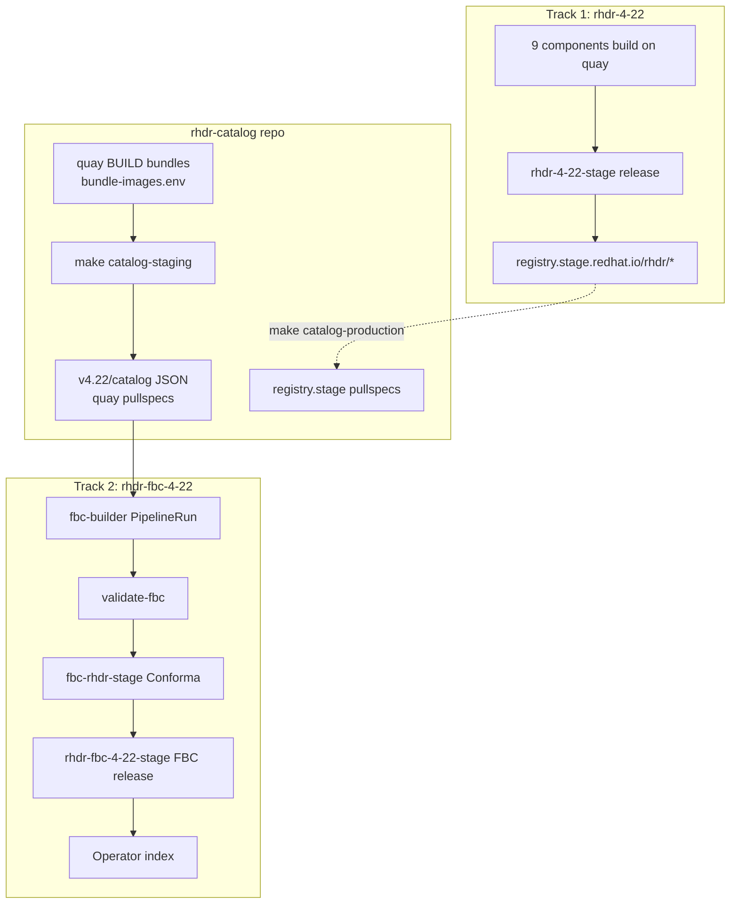

# Creating RHDR FBC Application in rhdr-tenant

**Status:** Implemented — catalog tooling and GitOps in place; Konflux pipeline validation in progress  
**Related JIRA:** [VIRTDR-141](https://redhat.atlassian.net/browse/VIRTDR-141) - RamenDR Standalone Konflux Tenant Setup  
**Companion doc:** [RHDRFBCApplicationGitOps.md](./RHDRFBCApplicationGitOps.md)

---

## Overview

The **File-Based Catalog (FBC)** aggregates four RHDR operator bundles into one OLM catalog image. Users install RHDR operators through standard OLM/OperatorHub after the catalog is published to the Red Hat operator index.

### What is in the FBC?

| OLM package (`allowedPackages`) | Konflux bundle component | Pyxis repo |
|--------------------------------|--------------------------|------------|
| `rhdr-hub-operator` | `rhdr-hub-operator-bundle-4-22` | `rhdr/rhdr-hub-operator-bundle` |
| `rhdr-cluster-operator` | `rhdr-cluster-operator-bundle-4-22` | `rhdr/rhdr-cluster-operator-bundle` |
| `rhdr-multicluster-operator` | `rhdr-multicluster-operator-bundle-4-22` | `rhdr/rhdr-multicluster-operator-bundle` |
| `rhdr-csi-addons-operator` | `rhdr-csi-addons-operator-bundle-4-22` | `rhdr/rhdr-csi-addons-operator-bundle` |

- **Channel:** `stable-4.22` — single bundle per package, no upgrade graph
- **Konflux application:** `rhdr-fbc-4-22` (tenant: `rhdr-tenant`)
- **Catalog repo:** `https://gitlab.cee.redhat.com/rh-ocp-dr/rhdr-catalog`
- **BUILD image:** `quay.io/redhat-user-workloads/rhdr-tenant/rhdr-fbc/rhdr-fbc-4-22`

---

## Architecture (two tracks)



1. **Track 1** (`rhdr-4-22`): builds and releases container images via `rh-advisories`
2. **Catalog repo** (`rhdr-catalog`): aggregates bundles into FBC JSON (quay BUILD paths during development)
3. **Track 2** (`rhdr-fbc-4-22`): builds catalog image, Conforma, FBC index release

See [rhdr-catalog/README.md](https://gitlab.cee.redhat.com/rh-ocp-dr/rhdr-catalog/-/blob/main/README.md) for full implementation detail.

---

## Prerequisites

### 1. Track 1 components building

All 9 `rhdr-4-22` components must build successfully. The four **bundle** components feed the catalog:

- `rhdr-hub-operator-bundle-4-22`
- `rhdr-cluster-operator-bundle-4-22`
- `rhdr-multicluster-operator-bundle-4-22`
- `rhdr-csi-addons-operator-bundle-4-22`

**Verify:**

```bash
# Konflux builds push to quay (no :latest — use version tag)
skopeo inspect --no-tags \
  docker://quay.io/redhat-user-workloads/rhdr-tenant/rhdr/rhdr-hub-operator-bundle-4-22:v4.22.0-86 \
  | jq -r '.Digest'
```

### 2. GitOps merged in konflux-release-data

| Resource | Path |
|----------|------|
| Tenant Application/Component | `tenants-config/.../rhdr-tenant/fbc-fragments/4-22/fbc-4-22.yaml` |
| Container stage RPA | `config/.../ReleasePlanAdmission/rhdr/rhdr-4-22-stage.yaml` |
| FBC stage RPA | `config/.../ReleasePlanAdmission/rhdr/rhdr-fbc-4-22-stage.yaml` |
| FBC ECP | `config/.../EnterpriseContractPolicy/fbc-rhdr-stage.yaml` |

### 3. Catalog repo scaffolded

Repo: `rh-ocp-dr/rhdr-catalog` with layout:

```
rhdr-catalog/
├── Makefile
├── bundle-images.env          # quay bundle digests
├── image-mappings.env         # prod/stage/build registry map
├── scripts/
│   ├── gen-catalog.sh         # catalog regeneration
│   ├── opm-container.sh       # opm wrapper
│   └── update-bundle-json.sh  # wrapper → gen-catalog.sh
├── v4.22/
│   ├── catalog.Dockerfile
│   └── catalog/
│       ├── rhdr-hub-operator/
│       ├── rhdr-cluster-operator/
│       ├── rhdr-multicluster-operator/
│       └── rhdr-csi-addons-operator/
└── .tekton/
    ├── rhdr-fbc-4-22-on-push.yaml
    ├── rhdr-fbc-4-22-on-pull-request.yaml
    └── images-mirror-set.yaml   # IDMS for FIPS check
```

---

## Step-by-step: Local catalog workflow

### Step 1: Log in to registries

```bash
podman login registry.redhat.io
podman login quay.io   # or ensure ~/.config/containers/auth.json exists
```

### Step 2: Update bundle digests

After each Konflux bundle build, update `bundle-images.env` with quay `@sha256` digests.
Paths come from `rhdr-4-22.yaml` ImageRepository — do not use staging registry digests.

```bash
cd rhdr-catalog

# Example per bundle (version tag varies per component)
skopeo inspect --no-tags \
  docker://quay.io/redhat-user-workloads/rhdr-tenant/rhdr/rhdr-hub-operator-bundle-4-22:v4.22.0-86 \
  | jq -r '.Digest'
```

### Step 3: Regenerate, validate, build

```bash
make catalog-staging    # opm render from quay + registry rewrite to quay BUILD
make validate           # opm validate catalog/
make build              # podman build catalog image locally
```

### Step 4: Commit and push

Push to `rh-ocp-dr/rhdr-catalog` `main` to trigger `rhdr-fbc-4-22-on-push`.

### Step 5: Verify Konflux pipeline

Expected pipeline tasks:

1. `fbc-builder` — builds catalog image to quay
2. `validate-fbc` — OCP 4.22 fragment validation (`olm.csv.metadata`)
3. `fbc-fips-check-oci-ta` — relatedImages pull (IDMS fallback)
4. `rhdr-fbc-4-22-enterprise-contract` — Conforma policy `fbc-rhdr-stage`

---

## Konflux component (already configured)

GitOps in `fbc-fragments/4-22/fbc-4-22.yaml`:

| Field | Value |
|-------|-------|
| Application | `rhdr-fbc-4-22` |
| Component | `rhdr-fbc-4-22` |
| Pipeline | `fbc-builder` (annotation required) |
| Git URL | `https://gitlab.cee.redhat.com/rh-ocp-dr/rhdr-catalog` |
| Context | `v4.22` |
| Dockerfile | `catalog.Dockerfile` |
| Output image | `quay.io/redhat-user-workloads/rhdr-tenant/rhdr-fbc/rhdr-fbc-4-22` |

Integration test: `rhdr-fbc-4-22-enterprise-contract` with policy `rhtap-releng-tenant/fbc-rhdr-stage`.

---

## Catalog generation modes

| Mode | Command | When |
|------|---------|------|
| **Staging (default)** | `make catalog-staging` | Development — quay BUILD pullspecs (allowed by `fbc-rhdr-stage` ECP) |
| **Production** | `make catalog-production` | After `rhdr-4-22-stage` release — swap quay → `registry.stage.redhat.io` per RPA |

Registry paths are never hardcoded in scripts. They come from `image-mappings.env`, derived from:

- `pyxis-repo-configs/products/rhdr/rhdr.yaml` (prod)
- `rhdr-4-22-stage` RPA (stage)
- `rhdr-4-22.yaml` ImageRepository (quay BUILD)

---

## Dockerfile reference

Actual `v4.22/catalog.Dockerfile`:

```dockerfile
FROM registry.redhat.io/openshift4/ose-operator-registry-rhel9:v4.22
ENTRYPOINT ["/bin/opm"]
CMD ["serve", "/configs", "--cache-dir=/tmp/cache"]
ADD catalog /configs
RUN ["/bin/opm", "serve", "/configs", "--cache-dir=/tmp/cache", "--cache-only"]
LABEL operators.operatorframework.io.index.configs.v1=/configs
```

---

## Troubleshooting

### `no policy.json file found` during `make catalog-staging`

`opm render` runs inside a container and must pull quay bundle images. Use `./scripts/opm-container.sh` (invoked by Makefile) — it mounts `policy.json` and registry auth.

### `manifest unknown` on quay digest

The digest in `bundle-images.env` may be from `registry.stage.redhat.io` instead of quay. Resolve digests from quay version tags (`v4.22.0-86`, etc.).

### `validate-fbc` fails on `olm.bundle.object`

OCP 4.22 requires `olm.csv.metadata`. Re-run `make catalog-staging` (uses `--migrate-level=bundle-object-to-csv-metadata`).

### Conforma `olm.allowed_registries_related` violations

Catalog `relatedImages` should point to quay BUILD paths after `catalog-staging`. Legacy `registry.redhat.io/rh-ocp-dr/rhdr/*` paths in bundle CSVs are rewritten by `gen-catalog.sh`.

### FIPS check cannot pull images

`.tekton/images-mirror-set.yaml` maps prod/stage paths to quay mirrors. Ensure `IDMS_PATH` is set in PAC PipelineRuns.

---

## Integration testing

### OLM smoke test (after FBC stage release)

```bash
kubectl get packagemanifests -n openshift-marketplace | grep rhdr
```

Expect: `rhdr-hub-operator`, `rhdr-cluster-operator`, `rhdr-multicluster-operator`, `rhdr-csi-addons-operator`.

### Install from catalog (example)

```bash
kubectl create namespace ramen-system

cat <<EOF | kubectl apply -f -
apiVersion: operators.coreos.com/v1alpha1
kind: Subscription
metadata:
  name: rhdr-hub-operator
  namespace: ramen-system
spec:
  channel: stable-4.22
  name: rhdr-hub-operator
  source: <catalog-source-name>
  sourceNamespace: openshift-marketplace
EOF
```

---

## Checklist

### Catalog repo (`rhdr-catalog`)

- [x] RHODF split JSON layout under `v4.22/catalog/`
- [x] `Makefile` with `catalog-staging`, `validate`, `build`
- [x] `gen-catalog.sh` + `bundle-images.env` + `image-mappings.env`
- [x] Channel `stable-4.22`, OLM packages `rhdr-*`
- [x] IDMS in `.tekton/images-mirror-set.yaml`
- [x] PAC CEL triggers fixed (`rhdr-fbc-4-22-on-push.yaml`)
- [ ] Konflux pipeline green (validate-fbc + Conforma)

### GitOps (`konflux-release-data`)

- [x] `rhdr-fbc-4-22` Application/Component with `fbc-builder`
- [x] `fbc-rhdr-stage` ECP
- [x] `rhdr-fbc-4-22-stage` RPA with `allowedPackages`
- [x] `rhdr-4-22-stage` RPA for container images

### Bundle repos

- [x] OLM package rebrand to `rhdr-*` on `4.22` branch
- [ ] All 4 bundles rebuilt and digests updated in `bundle-images.env`

---

## Related documentation

- [RHDRFBCApplicationGitOps.md](./RHDRFBCApplicationGitOps.md) — GitOps MR details and release config
- [rhdr-catalog/README.md](https://gitlab.cee.redhat.com/rh-ocp-dr/rhdr-catalog/-/blob/main/README.md) — implementation and make targets
- [OLM FBC docs](https://olm.operatorframework.io/docs/tasks/creating-a-catalog/)

---

## Sign-off

| Role | Status |
|------|--------|
| **Author** | Nadav Levanon |
| **Related JIRA** | [VIRTDR-141](https://redhat.atlassian.net/browse/VIRTDR-141) |
| **Last Updated** | 2026-07-13 |
