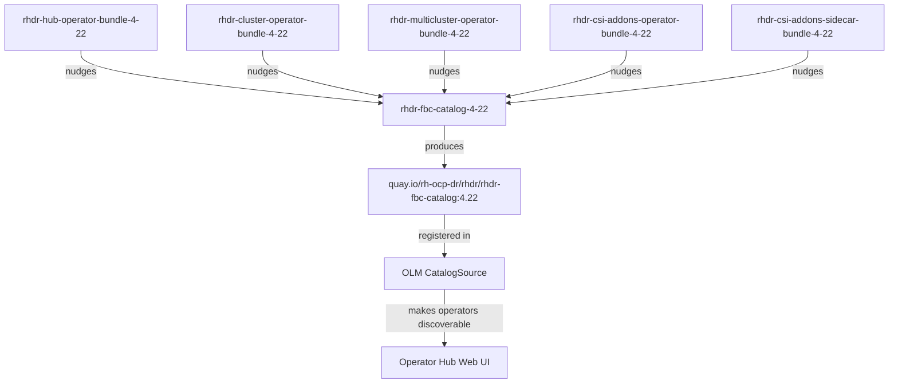

# Building the RHDR FBC Catalog for Version 4.22

**Document Version:** 1.1  
**Date Created:** June 1, 2026  
**Last Updated:** June 1, 2026 - CSI operator and sidecar marked as mandatory
**Status:** Reference Implementation Guide  
**Related Documents:** [TENANT_NAMING_AND_FORK_STRATEGY.md](../TENANT_NAMING_AND_FORK_STRATEGY.md), [ConstraintFileStages.md](./ConstraintFileStages.md)  
**JIRA Story:** [VIRTDR-141](https://redhat.atlassian.net/browse/VIRTDR-141)  
**Konflux Tenant:** `rhdr-tenant` namespace  
**Konflux Application:** `rhdr-4-22`  

---

## Executive Summary

This guide describes how to build the Filesystem-based Catalog (FBC) for Red Hat Disaster Recovery (RHDR) version 4.22. The FBC aggregates all RHDR operator bundles into a single OLM (Operator Lifecycle Manager) catalog image that can be deployed to Kubernetes clusters.

**What you will achieve:**
- ✅ Create a unified OLM catalog for all RHDR 4.22 operators
- ✅ Define the FBC repository structure in `rhdr-fbc-catalog`
- ✅ Build the catalog image through Konflux CI/CD
- ✅ Make RHDR operators discoverable and installable via OLM

---

### 📌 Critical Note: CSI Components are Mandatory

As of June 1, 2026, **the CSI addons operator and sidecar are required components** of the RHDR 4.22 release:

- **rhdr-csi-addons-operator** - Manages storage replication capabilities
- **rhdr-csi-addons-sidecar** - Enables disaster recovery sidecar functionality

These are **no longer conditional** and must be included in the FBC catalog and release bundles.

## Part 1: FBC Overview and Architecture

### What is an FBC?

A **Filesystem-based Catalog (FBC)** is a modern OLM catalog format that:
- Aggregates operator bundles into a single searchable registry
- Uses a declarative YAML directory structure (instead of SQLite database)
- Provides operator dependency resolution and version management
- Enables GitOps-based catalog updates

### RHDR FBC Purpose

The RHDR FBC serves as the **central distribution point** for all disaster recovery operators:

```
┌─────────────────────────────────────────────────────────────────┐
│                    rhdr-fbc-catalog Image                       │
│              quay.io/rh-ocp-dr/rhdr/rhdr-fbc-catalog:TAG        │
│                                                                 │
│  Contains references to:                                         │
│  ├─ rhdr-hub-operator-bundle                                    │
│  ├─ rhdr-cluster-operator-bundle                                │
│  ├─ rhdr-multicluster-operator-bundle                           │
│  ├─ rhdr-csi-addons-operator-bundle                             │
│  └─ rhdr-csi-addons-sidecar-bundle                              │
│                                                                 │
│  OLM CatalogSource points to this image                         │
│  ↓                                                              │
│  End users can discover and install operators from the web UI   │
└─────────────────────────────────────────────────────────────────┘
```

### Comparison: RHDR vs. RHODF

| Aspect | RHDR FBC | RHODF FBC |
|--------|----------|-----------|
| **Purpose** | Disaster Recovery operators only | Complete ODF storage stack |
| **Scope** | Hub, Cluster, MCO, CSI Addons | OCS, Rook, Ceph, NooBaa, ODF MCO |
| **Versioning** | Per-release (4.22, 4.23, etc.) | Per-OCP version |
| **Components** | ~4-5 operators | ~8-12 operators |
| **Location** | `rh-ocp-dr/rhdr-fbc-catalog` | `rhodf/konflux/rhodf-fbc` |
| **Image Registry** | `quay.io/rh-ocp-dr/rhdr/` | `quay.io/rh-ocp-dr/rhodf/` |

---

## Part 2: Required Components from RHDR Tenant

### 2.1 Operator Bundles (Prerequisites)

Before building the FBC, all operator bundles must be published to the registry. These are built by their respective components in Konflux:

| Component | Bundle Image | Status |
|-----------|--------------|--------|
| `rhdr-hub-operator-bundle-4-22` | `quay.io/rh-ocp-dr/rhdr/rhdr-hub-operator-bundle:4.22` | ✅ Required |
| `rhdr-cluster-operator-bundle-4-22` | `quay.io/rh-ocp-dr/rhdr/rhdr-cluster-operator-bundle:4.22` | ✅ Required |
| `rhdr-multicluster-operator-bundle-4-22` | `quay.io/rh-ocp-dr/rhdr/rhdr-multicluster-operator-bundle:4.22` | ✅ Required |
| `rhdr-csi-addons-operator-bundle-4-22` | `quay.io/rh-ocp-dr/rhdr/rhdr-csi-addons-operator-bundle:4.22` | ✅ **Required** |
| `rhdr-csi-addons-sidecar-bundle-4-22` | `quay.io/rh-ocp-dr/rhdr/rhdr-csi-addons-sidecar-bundle:4.22` | ✅ **Required** |

### 2.2 Build Dependencies

The FBC build depends on these RHDR tenant components having **completed builds**:



### 2.3 Required Tenant Configuration Changes

Before building the FBC, update the Konflux tenant with these configurations:

#### A. Update Application Metadata (if not already done)

```yaml
apiVersion: appstudio.redhat.com/v1alpha1
kind: Application
metadata:
  name: rhdr-4-22
  namespace: rhdr-tenant
  labels:
    app.kubernetes.io/name: rhdr
    app.kubernetes.io/version: "4.22"
spec:
  displayName: "RHDR 4.22"
  description: "Red Hat Disaster Recovery 4.22 - Hub, Cluster, and Console components"
```

#### B. Add FBC Component to Application

```yaml
---
apiVersion: appstudio.redhat.com/v1alpha1
kind: Component
metadata:
  annotations:
    build.appstudio.openshift.io/pipeline: '{"name":"docker-build-oci-ta","bundle":"latest"}'
  name: rhdr-fbc-catalog-4-22
  namespace: rhdr-tenant
spec:
  application: rhdr-4-22
  componentName: rhdr-fbc-catalog-4-22
  # FBC catalog receives nudges from all bundle components
  build-nudges-ref:
    - rhdr-hub-operator-bundle-4-22
    - rhdr-cluster-operator-bundle-4-22
    - rhdr-multicluster-operator-bundle-4-22
    - rhdr-csi-addons-operator-bundle-4-22
    - rhdr-csi-addons-sidecar-bundle-4-22
  source:
    git:
      url: https://gitlab.cee.redhat.com/rh-ocp-dr/rhdr-fbc-catalog
      revision: main  # or specific branch like "4.22"
      context: ./
      dockerfileUrl: "catalog.Dockerfile"  # or just "Dockerfile"
  container-image:
    name: rhdr-fbc-catalog
    imagePullPolicy: Always
```

---

## Part 3: GitOps Architecture and Provisioning Model

### 3.1 Understanding the Two Workflows

The RHDR FBC configuration follows **two parallel workflows** that must be coordinated:

```
┌─────────────────────────────────────────────────────────────────┐
│                    Dual-Path Architecture                       │
├─────────────────────────────────────────────────────────────────┤
│                                                                 │
│ PATH 1: GitOps (Authoritative Source)                          │
│ ────────────────────────────────────────────────────────────    │
│                                                                 │
│ Repository: konflux-release-data/tenants-config                │
│ Directory: cluster/stone-prod-p02/tenants/rhdr-tenant/         │
│ File: rhdr-4-22.yaml  (contains Component definitions)          │
│                                                                 │
│ Characteristics:                                                │
│ ✅ Version controlled (Git history)                             │
│ ✅ Reproducible deployments                                     │
│ ✅ Auditable (Git blame, commits)                               │
│ ✅ Rollback-capable                                             │
│ ✅ ArgoCD syncs: Git → Kubernetes cluster                       │
│                                                                 │
│ Sync Flow:                                                      │
│ Git commit → ArgoCD detects change → Applies to cluster        │
│                                                                 │
├─────────────────────────────────────────────────────────────────┤
│                                                                 │
│ PATH 2: Imperative Changes (Cluster-Direct)                    │
│ ────────────────────────────────────────────────────────────    │
│                                                                 │
│ Methods:                                                        │
│ • oc apply -f component.yaml                                    │
│ • Konflux UI: "Add Component" button                            │
│ • kubectl patch component                                       │
│                                                                 │
│ Characteristics:                                                │
│ ⚠️  Not version controlled (unless manually committed)          │
│ ⚠️  Not reproducible without documentation                      │
│ ⚠️  Harder to audit                                             │
│ ⚠️  Can drift from tenants-config source of truth              │
│ ✅ Immediate cluster effect (no sync delay)                     │
│                                                                 │
│ Direct Flow:                                                    │
│ OC CLI / UI → Kubernetes API (etcd) immediately                │
│                                                                 │
└─────────────────────────────────────────────────────────────────┘
```

### 3.2 Critical Point: Provisioning vs. Testing

**Important distinction:**

| Aspect | Imperative (OC/UI) | GitOps (tenants-config) |
|--------|-------------------|------------------------|
| **Purpose** | Testing, troubleshooting | Production deployment |
| **Persistence** | Only in cluster memory | Permanent (Git) |
| **Reproducibility** | Manual re-creation needed | Automatic (ArgoCD) |
| **Audit Trail** | Limited | Complete (Git history) |
| **Cluster Recreation** | Lost | Restored from Git |
| **Team Collaboration** | Not shared | Shared across team |

### 3.3 Recommended Workflow

For RHDR FBC, follow this **three-step workflow**:

```
Step 1: DESIGN & TEST
├─ Use Konflux UI or OC CLI to test configuration
├─ Verify builds succeed
├─ Validate operators are discoverable
└─ Test CatalogSource integration

↓

Step 2: COMMIT TO GitOps
├─ Document tested configuration in conflict-release-data
├─ Edit: tenants-config/cluster/stone-prod-p02/tenants/rhdr-tenant/rhdr-4-22.yaml
├─ Run: tox (validate schemas)
├─ Commit: git add, git commit, git push
└─ Create Merge Request for code review

↓

Step 3: DEPLOY VIA GitOps
├─ Merge request approved and merged to main
├─ ArgoCD detects change
├─ ArgoCD applies configuration to cluster
├─ Configuration becomes source-of-truth
└─ Environment is reproducible and auditable
```

### 3.4 Practical Example: Adding FBC Component

**What NOT to do (only imperative):**
```bash
# ❌ This creates a component but leaves tenants-config out of sync
oc apply -f rhdr-fbc-component.yaml -n rhdr-tenant
# Result: Cluster has component, but konflux-release-data doesn't know about it
```

**What TO do (test then commit):**
```bash
# ✅ Step 1: Test the configuration
oc apply -f rhdr-fbc-component.yaml -n rhdr-tenant
# Verify build works, operators discoverable, etc.

# ✅ Step 2: Commit to GitOps
cd /path/to/konflux-release-data
git checkout -b add-fbc-catalog-4-22

# Edit tenants-config/cluster/stone-prod-p02/tenants/rhdr-tenant/rhdr-4-22.yaml
# Add the FBC component definition

git add tenants-config/
git commit -m "Add rhdr-fbc-catalog-4-22 component definition"
tox  # Validate all configurations
git push origin add-fbc-catalog-4-22

# Step 3: Create MR → Review → Merge
# ArgoCD automatically syncs verified configuration to cluster
```

### 3.5 How This Relates to tenants-config

The `rhdr-4-22.yaml` file in `tenants-config/cluster/stone-prod-p02/tenants/rhdr-tenant/` is the **single source of truth**:

```yaml
# File: tenants-config/cluster/stone-prod-p02/tenants/rhdr-tenant/rhdr-4-22.yaml
---
apiVersion: appstudio.redhat.com/v1alpha1
kind: Application
metadata:
  name: rhdr-4-22
  namespace: rhdr-tenant
spec:
  displayName: "RHDR 4.22"
  description: "Red Hat Disaster Recovery 4.22"
---
apiVersion: appstudio.redhat.com/v1alpha1
kind: Component
metadata:
  name: rhdr-hub-operator-4-22
  namespace: rhdr-tenant
spec:
  # Component definition from GitOps
  # ↑ ArgoCD ensures cluster matches this definition
---
apiVersion: appstudio.redhat.com/v1alpha1
kind: Component
metadata:
  name: rhdr-fbc-catalog-4-22  # ← Add this when building FBC
  namespace: rhdr-tenant
spec:
  # FBC component definition
```

**When you change this file:**
1. Git history tracks the change
2. Code review validates the change
3. Once merged, ArgoCD syncs it to the cluster
4. Cluster state always matches Git (unless someone manually oc apply)

### 3.6 Auto-Generated Files

After running `./build-manifests.sh` in tenants-config, Kustomize generates:

```
tenants-config/auto-generated/
└── cluster/stone-prod-p02/tenants/rhdr-tenant/
    ├── appstudio.redhat.com_v1alpha1_component_rhdr-hub-operator-4-22.yaml
    ├── appstudio.redhat.com_v1alpha1_component_rhdr-fbc-catalog-4-22.yaml  ← Generated
    └── appstudio.redhat.com_v1alpha1_imagerepository_rhdr-fbc-catalog-4-22-image-repository.yaml
```

**Important:** These are auto-generated and should be committed alongside source files:
```bash
git add tenants-config/cluster/  # Source definitions
git add tenants-config/auto-generated/  # Generated manifests
git commit -m "Update RHDR 4.22 configuration with FBC catalog"
```

---

## Part 4: FBC Repository Structure

### 4.1 Repository Layout

The `rhdr-fbc-catalog` repository must have this structure:

```
rhdr-fbc-catalog/
├── Dockerfile                          # Main catalog image build
├── catalog.Dockerfile                  # Alternative naming (RHODF pattern)
├── catalog/
│   ├── rhdr-hub-operator/
│   │   └── metadata/
│   │       └── annotations.yaml        # Hub operator annotations
│   ├── rhdr-cluster-operator/
│   │   └── metadata/
│   │       └── annotations.yaml        # Cluster operator annotations
│   ├── rhdr-multicluster-operator/
│   │   └── metadata/
│   │       └── annotations.yaml        # MCO annotations
│   ├── rhdr-csi-addons-operator/
│   │   └── metadata/
│   │       └── annotations.yaml        # CSI addons operator annotations
│   └── rhdr-csi-addons-sidecar/
│       └── metadata/
│           └── annotations.yaml        # CSI addons sidecar annotations
├── .tekton/
│   ├── rhdr-fbc-catalog-on-push.yaml
│   └── rhdr-fbc-catalog-on-pull-request.yaml
├── .github/
│   └── workflows/                       # (Optional) Local testing
├── remote_source/
│   ├── cachito.env                     # Cachito dependency manifest
│   └── app/
│       └── [source code if using local build]
├── README.md
└── .gitignore
```

### 4.2 Key Files Explained

#### Dockerfile

```dockerfile
# Base image: OLM catalog builder
FROM quay.io/operator-framework/opm:latest AS builder

# Copy catalog YAML structure
COPY catalog/ /workspace/catalog/

# Generate catalog image
RUN opm generate dockerfile /workspace/catalog/ -c alpine

# Final image
FROM quay.io/operator-framework/opm:latest-alpine
COPY --from=builder /workspace/catalog/index.db /indices/
COPY --from=builder /workspace/catalog/index.db /database/index.db

# Health check
HEALTHCHECK --interval=10s --timeout=5s --start-period=10s --retries=3 \
    CMD opm serve /database --cache-enforcement=off || exit 1

EXPOSE 50051

# Start OPM server
ENTRYPOINT ["opm", "serve", "/database", "--cache-enforcement=off"]
```

#### catalog/rhdr-hub-operator/metadata/annotations.yaml

```yaml
annotations:
  operators.operatorframework.io.bundle.package.v1: rhdr-hub-operator
  operators.operatorframework.io.bundle.channels.v1: stable
  operators.operatorframework.io.bundle.channel.default.v1: stable
```

#### .tekton/rhdr-fbc-catalog-on-push.yaml

```yaml
apiVersion: tekton.dev/v1
kind: PipelineRun
metadata:
  annotations:
    pipelinesascode.tekton.dev/on-event: "[push]"
    pipelinesascode.tekton.dev/on-target-branch: "[main]"
  name: rhdr-fbc-catalog-on-push
  namespace: rhdr-tenant
spec:
  pipelineRef:
    resolver: git
    params:
      - name: url
        value: https://gitlab.cee.redhat.com/conflict/build-definitions
      - name: revision
        value: main
      - name: pathInRepo
        value: pipelines/docker-build-oci.yaml
  workspaces:
    - name: workspace
      volumeClaimTemplate:
        spec:
          storageClassName: fast
          accessModes:
            - ReadWriteOnce
          resources:
            requests:
              storage: 100Gi
  params:
    - name: git-url
      value: $(tt.params.git_repo_url)
    - name: revision
      value: $(tt.params.git_commit_sha)
    - name: dockerfile
      value: Dockerfile
    - name: image-expires-after
      value: 30d
```

---

## Part 5: Three Ways to Build the FBC

### Approach 1: GitOps Way (RECOMMENDED - PRODUCTION)

**Best for:** Production releases, automated CI/CD, auditability

#### Prerequisites
- ✅ Konflux tenant `rhdr-tenant` exists
- ✅ All operator bundle components have completed builds
- ✅ `rhdr-fbc-catalog` repository exists in `rh-ocp-dr` GitLab group

#### Step 1: Create Release Plan Admission for FBC (konflux-release-data)

In the konflux-release-data repository, create the RPA for the FBC:

**File:** `config/stone-prod-p02.hjvn.p1/product/ReleasePlanAdmission/rhdr-tenant/rhdr-fbc-4-22.yaml`

```yaml
apiVersion: appstudio.redhat.com/v1alpha1
kind: ReleasePlanAdmission
metadata:
  name: rhdr-fbc-4-22
  namespace: rhtap-releng-tenant
spec:
  applications:
    - rhdr-4-22
  origin: rhdr-tenant  # Links to constraints validation
  policy: registry-rhdr-prod
  data:
    releaseNotes:
      product_name: "Red Hat Disaster Recovery"
      product_version: "4.22"
      product_id: VIRTDR  # Update with actual product ID
    intention: production
    mapping:
      components:
        - name: rhdr-fbc-catalog-4-22
          registry_url: "quay.io/rh-ocp-dr/rhdr/rhdr-fbc-catalog"
      registrySecret: konflux-release-service-access-management-token
  pipeline:
    pipelineRef:
      resolver: git
      params:
        - name: url
          value: https://github.com/openshift-pipelines/release-service-configs
        - name: revision
          value: main
        - name: pathInRepo
          value: pipelines/fbc-release.yaml
    serviceAccountName: release-registry-prod
    timeouts:
      pipeline: "4h0m0s"
      tasks: "3h50m0s"
```

#### Step 2: Validate Configuration

Run Konflux-release-data tests:

```bash
cd /path/to/konflux-release-data
tox  # Validates all schemas, CODEOWNERS, and configuration

# Run specific validation
tox -e test  # Schema validation
tox -e integration  # Integration tests (requires API access)
```

#### Step 3: Commit and Deploy via GitOps

```bash
git add config/stone-prod-p02.hjvn.p1/product/ReleasePlanAdmission/rhdr-tenant/
git commit -m "Add FBC release configuration for RHDR 4.22

- Create ReleasePlanAdmission for rhdr-fbc-catalog-4-22
- Reference all bundle components in mapping
- Configure for production registry push
- Links to VIRTDR-141"

git push origin <branch>
# Create merge request → approval → ArgoCD auto-deploys
```

#### Step 4: Verify Release Execution

The GitOps pipeline will:
1. Trigger a Tekton PipelineRun in the release namespace
2. Build the FBC catalog image
3. Run compliance checks (Enterprise Contract Policy)
4. Push to registry: `quay.io/rh-ocp-dr/rhdr/rhdr-fbc-catalog:4.22`
5. Generate release artifacts

**Monitor in Konflux:**
```bash
kubectl get pipelinerun -n rhdr-tenant | grep fbc
kubectl logs -n rhdr-tenant -l pipelinerun=rhdr-fbc-catalog-4-22
```

---

### Approach 2: Konflux UI (INTERACTIVE)

**Best for:** Quick testing, troubleshooting, learning

#### Prerequisites
- ✅ Access to Konflux web UI
- ✅ Member of `rhdr-tenant` namespace
- ✅ All bundle components already have images in registry

#### Step 1: Add Component via Konflux UI

1. **Navigate to Application**
   - Open Konflux UI
   - Select namespace: `rhdr-tenant`
   - Select application: `rhdr-4-22`

2. **Add Component**
   - Click "Add Component" button
   - Fill in component details:
     - **Component Name:** `rhdr-fbc-catalog-4-22`
     - **Git Repository URL:** `https://gitlab.cee.redhat.com/rh-ocp-dr/rhdr-fbc-catalog`
     - **Git Revision:** `main` (or `4.22` if using branch)
     - **Dockerfile Path:** `Dockerfile`
     - **Container Registry:** `quay.io/rh-ocp-dr/rhdr`
     - **Image Name:** `rhdr-fbc-catalog`

3. **Configure Build-Nudges**
   - In the "Advanced" section, set build dependencies:
     - `rhdr-hub-operator-bundle-4-22`
     - `rhdr-cluster-operator-bundle-4-22`
     - `rhdr-multicluster-operator-bundle-4-22`
     - (Optional) `rhdr-csi-addons-operator-bundle-4-22`

4. **Click "Create Component"**

#### Step 2: Trigger Manual Build

1. **Navigate to Component**
   - Click on `rhdr-fbc-catalog-4-22` in the components list

2. **Trigger Build**
   - Click "Trigger Build" button
   - View real-time build logs
   - Wait for completion (typically 5-15 minutes)

3. **Verify Success**
   - Build status shows "Succeeded" (green checkmark)
   - Image pushed to `quay.io/rh-ocp-dr/rhdr/rhdr-fbc-catalog:latest`

#### Step 3: Create Snapshot

1. **In Application View**
   - Click "Create Snapshot"
   - Select components:
     - All bundle components
     - `rhdr-fbc-catalog-4-22`
   - Give snapshot a name: `rhdr-4.22-v1`
   - Click "Create Snapshot"

#### Step 4: View Snapshot

```bash
kubectl get snapshot -n rhdr-tenant
kubectl describe snapshot rhdr-4.22-v1 -n rhdr-tenant
```

---

### Approach 3: OC CLI (DECLARATIVE)

**Best for:** Automation, scripting, CI/CD integration, version control

#### Prerequisites
- ✅ `oc` CLI installed and authenticated to Konflux cluster
- ✅ Access to `rhdr-tenant` namespace
- ✅ All bundle components with published images

#### Step 1: Create ImageRepository Resource

```bash
cat <<EOF | oc apply -f -
apiVersion: appstudio.redhat.com/v1alpha1
kind: ImageRepository
metadata:
  name: rhdr-fbc-catalog-4-22-image-repository
  namespace: rhdr-tenant
spec:
  image:
    name: rhdr-fbc-catalog
    tags:
      - "4.22"
      - "latest"
EOF
```

#### Step 2: Create Component Resource

```bash
cat <<EOF | oc apply -f -
apiVersion: appstudio.redhat.com/v1alpha1
kind: Component
metadata:
  name: rhdr-fbc-catalog-4-22
  namespace: rhdr-tenant
  annotations:
    build.appstudio.openshift.io/pipeline: '{"name":"docker-build-oci-ta","bundle":"latest"}'
spec:
  application: rhdr-4-22
  componentName: rhdr-fbc-catalog-4-22
  build-nudges-ref:
    - rhdr-hub-operator-bundle-4-22
    - rhdr-cluster-operator-bundle-4-22
    - rhdr-multicluster-operator-bundle-4-22
  source:
    git:
      url: https://gitlab.cee.redhat.com/rh-ocp-dr/rhdr-fbc-catalog
      revision: main
      context: ./
      dockerfileUrl: Dockerfile
  container-image:
    name: rhdr-fbc-catalog
    imagePullPolicy: Always
EOF
```

#### Step 3: Verify Component Created

```bash
oc get component rhdr-fbc-catalog-4-22 -n rhdr-tenant -o yaml

# Check status
oc describe component rhdr-fbc-catalog-4-22 -n rhdr-tenant
```

#### Step 4: Trigger Build via Tekton

Create a PipelineRun to build the component:

```bash
cat <<EOF | oc apply -f -
apiVersion: tekton.dev/v1
kind: PipelineRun
metadata:
  name: rhdr-fbc-catalog-4-22-build-$(date +%s)
  namespace: rhdr-tenant
spec:
  pipelineRef:
    resolver: git
    params:
      - name: url
        value: https://gitlab.cee.redhat.com/conflict/build-definitions
      - name: revision
        value: main
      - name: pathInRepo
        value: pipelines/docker-build-oci.yaml
  workspaces:
    - name: workspace
      volumeClaimTemplate:
        spec:
          storageClassName: fast
          accessModes:
            - ReadWriteOnce
          resources:
            requests:
              storage: 100Gi
  params:
    - name: git-url
      value: "https://gitlab.cee.redhat.com/rh-ocp-dr/rhdr-fbc-catalog"
    - name: revision
      value: "main"
    - name: dockerfile
      value: "Dockerfile"
    - name: image-url
      value: "quay.io/rh-ocp-dr/rhdr/rhdr-fbc-catalog"
    - name: image-tag
      value: "4.22"
    - name: image-expires-after
      value: "30d"
EOF
```

#### Step 5: Monitor Build Progress

```bash
# Watch PipelineRun status
oc get pipelinerun -n rhdr-tenant | grep fbc
oc logs -f -n rhdr-tenant pipelinerun/rhdr-fbc-catalog-4-22-build-<timestamp>

# Check TaskRuns
oc get taskrun -n rhdr-tenant -l pipelinerun=rhdr-fbc-catalog-4-22-build-<timestamp>

# View final status
oc describe pipelinerun rhdr-fbc-catalog-4-22-build-<timestamp> -n rhdr-tenant
```

#### Step 6: Verify Image in Registry

```bash
# Check if image was pushed
skopeo inspect docker://quay.io/rh-ocp-dr/rhdr/rhdr-fbc-catalog:4.22

# Or via quay.io API
curl -s https://quay.io/api/v1/repository/rh-ocp-dr/rhdr/rhdr-fbc-catalog | jq '.tags'
```

#### Step 7: Create Snapshot (Programmatically)

```bash
cat <<EOF | oc apply -f -
apiVersion: appstudio.redhat.com/v1alpha1
kind: Snapshot
metadata:
  name: rhdr-4.22-fbc-v1
  namespace: rhdr-tenant
spec:
  application: rhdr-4-22
  displayName: "RHDR 4.22 with FBC Catalog v1"
  components:
    - name: rhdr-hub-operator-4-22
      containerImage: quay.io/rh-ocp-dr/rhdr/rhdr-hub-operator:4.22
    - name: rhdr-cluster-operator-4-22
      containerImage: quay.io/rh-ocp-dr/rhdr/rhdr-cluster-operator:4.22
    - name: rhdr-multicluster-operator-4-22
      containerImage: quay.io/rh-ocp-dr/rhdr/rhdr-multicluster-operator:4.22
    - name: rhdr-fbc-catalog-4-22
      containerImage: quay.io/rh-ocp-dr/rhdr/rhdr-fbc-catalog:4.22
EOF
```

---

## Part 6: Verification and Testing

### 6.1 Verify FBC Catalog Structure

After building the catalog image, verify its contents:

```bash
# Pull the catalog image locally
podman pull quay.io/rh-ocp-dr/rhdr/rhdr-fbc-catalog:4.22

# Run the catalog server
podman run -p 50051:50051 quay.io/rh-ocp-dr/rhdr/rhdr-fbc-catalog:4.22

# In another terminal, query the catalog
# Note: Requires grpcurl or similar tool
grpcurl -plaintext localhost:50051 api.Registry/ListBundles

# Expected output (sample):
# {
#   "bundles": [
#     {
#       "name": "rhdr-hub-operator",
#       "version": "4.22.0"
#     },
#     {
#       "name": "rhdr-cluster-operator",
#       "version": "4.22.0"
#     },
#     {
#       "name": "rhdr-multicluster-operator",
#       "version": "4.22.0"
#     }
#   ]
# }
```

### 6.2 Test OLM Integration

Create a CatalogSource pointing to the FBC:

```yaml
apiVersion: operators.coreos.com/v1alpha1
kind: CatalogSource
metadata:
  name: rhdr-catalog
  namespace: openshift-marketplace  # Or custom namespace
spec:
  sourceType: grpc
  image: quay.io/rh-ocp-dr/rhdr/rhdr-fbc-catalog:4.22
  displayName: "Red Hat Disaster Recovery Operators"
  publisher: "Red Hat"
  updateStrategy:
    registryPoll:
      interval: 30m
```

### 6.3 Verify Operators are Discoverable

```bash
# In OpenShift/Kubernetes cluster with CatalogSource created:

# List available packages
oc get packagemanifests -n openshift-marketplace | grep rhdr

# View package details
oc describe packagemanifest rhdr-hub-operator -n openshift-marketplace

# Install operator via subscription
cat <<EOF | oc apply -f -
apiVersion: operators.coreos.com/v1alpha1
kind: OperatorGroup
metadata:
  name: rhdr-operators
  namespace: openshift-disaster-recovery
---
apiVersion: operators.coreos.com/v1alpha1
kind: Subscription
metadata:
  name: rhdr-hub-operator-subscription
  namespace: openshift-disaster-recovery
spec:
  channel: stable
  name: rhdr-hub-operator
  source: rhdr-catalog
  sourceNamespace: openshift-marketplace
EOF

# Verify installation
oc get deployment -n openshift-disaster-recovery
oc get csv -n openshift-disaster-recovery
```

---

## Part 7: Troubleshooting

### Issue: Build Fails with "Bundle Image Not Found"

**Cause:** A referenced bundle component hasn't been built yet.

**Solution:**
1. Verify all bundle components have completed builds:
   ```bash
   oc get component -n rhdr-tenant | grep bundle
   oc describe component rhdr-hub-operator-bundle-4-22 -n rhdr-tenant
   ```
2. Check for failed builds:
   ```bash
   oc get pipelinerun -n rhdr-tenant --field-selector=status.conditions[?(@.type=="Succeeded")].status=False
   ```
3. Rebuild failed components before retrying FBC build

### Issue: OPM Build Fails with "Invalid Bundle"

**Cause:** Bundle metadata is malformed or missing.

**Solution:**
1. Verify bundle Dockerfile is valid:
   ```bash
   git clone https://gitlab.cee.redhat.com/rh-ocp-dr/rhdr-fbc-catalog
   cd rhdr-fbc-catalog
   cat Dockerfile | grep -A5 "bundle/"
   ```
2. Check bundle metadata:
   ```bash
   podman pull quay.io/rh-ocp-dr/rhdr/rhdr-hub-operator-bundle:4.22
   podman run quay.io/rh-ocp-dr/rhdr/rhdr-hub-operator-bundle:4.22 \
     head -20 metadata/annotations.yaml
   ```

### Issue: CatalogSource Stays in "UnhealthyRegistry" State

**Cause:** Catalog gRPC server isn't responding correctly.

**Solution:**
1. Check pod logs:
   ```bash
   oc logs -f <catalogsource-pod> -n openshift-marketplace
   ```
2. Verify catalog image:
   ```bash
   podman inspect quay.io/rh-ocp-dr/rhdr/rhdr-fbc-catalog:4.22
   ```
3. Test gRPC connectivity:
   ```bash
   oc port-forward pod/<catalogsource-pod> 50051:50051
   grpcurl -plaintext localhost:50051 list
   ```

---

## Part 8: Best Practices and Recommendations

### 8.1 Recommended Approach: GitOps

**Why GitOps for production:**
- ✅ Complete audit trail (Git history)
- ✅ Automated validation (tox, schemas)
- ✅ Reproducible builds (same configuration every time)
- ✅ Rollback capability (revert Git commit)
- ✅ Compliance and governance (Konflux-release-data)

**Workflow:**
```
Git Feature Branch
  ↓
Create RPA in konflux-release-data
  ↓
Run: tox (validate all configs)
  ↓
Push to GitLab
  ↓
Create Merge Request
  ↓
Code Review (CODEOWNERS approval)
  ↓
Merge to main
  ↓
ArgoCD auto-deploys RPA
  ↓
Konflux release pipeline triggers
  ↓
FBC catalog built and pushed to registry
```

### 8.2 When to Use Konflux UI

**Good for:**
- Learning Konflux workflow
- Quick testing of new bundle components
- Troubleshooting build issues
- Emergency manual builds

**Avoid for:**
- Production releases (use GitOps instead)
- Building frequently (use automation)
- Auditing requirements (no Git history)

### 8.3 When to Use OC CLI

**Good for:**
- Scripting and automation
- Integration with existing CI/CD pipelines
- Advanced Kubernetes operations
- Batch operations

**Avoid for:**
- Users unfamiliar with kubectl/oc
- Complex deployments (use GitOps instead)
- Production without infrastructure-as-code backing

### 8.4 GitOps Integration with tenants-config (CRITICAL)

**Important Architectural Pattern:**

Changes made via Konflux UI or OC CLI are **NOT automatically synchronized** to the `konflux-release-data/tenants-config` repository. This creates a critical divergence between:

- **Cluster State**: Live components in Kubernetes
- **Source of Truth**: Git-based configuration in konflux-release-data

**To avoid configuration drift:**

1. **Test changes in cluster** (via UI or OC CLI)
2. **Commit tested configuration** to `tenants-config`:
   ```bash
   cd /path/to/konflux-release-data
   git checkout -b add-fbc-catalog-4-22
   
   # Edit tenants-config/cluster/stone-prod-p02/tenants/rhdr-tenant/rhdr-4-22.yaml
   # Add FBC component definition
   
   git add tenants-config/
   git commit -m "Add rhdr-fbc-catalog-4-22 component"
   tox  # Validate
   git push origin add-fbc-catalog-4-22
   ```
3. **Create and merge MR** for code review
4. **ArgoCD auto-syncs** from Git to cluster
5. **Configuration becomes reproducible** and version-controlled

**Why this matters:**
- ✅ Cluster can be recreated from Git
- ✅ All changes have audit trail
- ✅ Rollback is simple (git revert)
- ✅ Team has shared source of truth
- ❌ Cluster-only changes can be lost
- ❌ Undocumented manual changes cause drift

**Golden Rule:** If it's not in `tenants-config`, it's not part of the permanent deployment.

---

## Part 9: Release Configuration Templates

### 9.1 Full RPA for RHDR 4.22 FBC Release

Save this as `config/stone-prod-p02.hjvn.p1/product/ReleasePlanAdmission/rhdr-tenant/rhdr-fbc-4-22.yaml`:

```yaml
---
apiVersion: appstudio.redhat.com/v1alpha1
kind: ReleasePlanAdmission
metadata:
  name: rhdr-fbc-4-22
  namespace: rhtap-releng-tenant
spec:
  # Link to RHDR tenant
  applications:
    - rhdr-4-22

  # Validation layer
  origin: rhdr-tenant
  policy: registry-rhdr-prod

  # Release metadata
  data:
    releaseNotes:
      product_name: "Red Hat Disaster Recovery"
      product_version: "4.22"
      product_id: VIRTDR  # Update with actual product ID
      components:
        - rhdr-hub-operator
        - rhdr-cluster-operator
        - rhdr-multicluster-operator
        - rhdr-csi-addons-operator
        - rhdr-csi-addons-sidecar

    intention: production

    mapping:
      components:
        - name: rhdr-fbc-catalog-4-22
          registry_url: "quay.io/rh-ocp-dr/rhdr/rhdr-fbc-catalog"

      registrySecret: konflux-release-service-access-management-token

  # Pipeline configuration
  pipeline:
    pipelineRef:
      resolver: git
      params:
        - name: url
          value: https://github.com/openshift-pipelines/release-service-configs
        - name: revision
          value: main
        - name: pathInRepo
          value: pipelines/fbc-release.yaml

    serviceAccountName: release-registry-prod

    timeouts:
      pipeline: "4h0m0s"
      tasks: "3h50m0s"
```

### 9.2 Enterprise Contract Policy for RHDR

Create `config/stone-prod-p02.hjvn.p1/product/EnterpriseContractPolicy/registry-rhdr-prod.yaml`:

```yaml
---
apiVersion: appstudio.redhat.com/v1alpha1
kind: EnterpriseContractPolicy
metadata:
  name: registry-rhdr-prod
  namespace: rhtap-releng-tenant
spec:
  description: 'Rules for shipping Red Hat Disaster Recovery FBC to production registry'
  publicKey: 'k8s://openshift-pipelines/public-key'
  sources:
    - data:
        - github.com/release-engineering/rhtap-ec-policy//data
      name: Release Policies
      policy:
        - github.com/release-engineering/rhtap-ec-policy//policy/fbc_validation

  rules:
    - rule_type__: disallow_unresolvable_attestation
    - rule_type__: disallow_unsigned_container_image
    - rule_type__: allow_cveless_artifact  # FBC has no CVEs
```

---

## Part 10: Comparison with RHODF FBC Process

### Similar Steps Between RHDR and RHODF

| Step | RHDR | RHODF |
|------|------|-------|
| Define catalog structure | ✅ `rhdr-fbc-catalog` | ✅ `rhodf-fbc` |
| Create Dockerfile | ✅ Uses `opm` | ✅ Uses `opm` |
| Reference bundles | ✅ In `catalog/` dirs | ✅ In `catalog/` dirs |
| Build via Konflux | ✅ PipelineRun | ✅ PipelineRun |
| Push to registry | ✅ quay.io/rh-ocp-dr/rhdr | ✅ quay.io/rh-ocp-dr/rhodf |
| Create CatalogSource | ✅ OLM CatalogSource | ✅ OLM CatalogSource |

### Key Differences

| Aspect | RHDR | RHODF |
|--------|------|-------|
| **Scope** | DR operators only (~5) | Complete ODF stack (~12) |
| **Source Repos** | rh-ocp-dr group | rhodf group |
| **Versions** | Per-release (4.22) | Per-OCP version |
| **Dependencies** | Minimal (just operators) | Complex (storage deps) |
| **Release Cadence** | Aligned with RamenDR | Aligned with OCP |

---

## Part 11: References and Related Documentation

### Internal Documents
- [TENANT_NAMING_AND_FORK_STRATEGY.md](../TENANT_NAMING_AND_FORK_STRATEGY.md) - Repository naming and forking decisions
- [ConstraintFileStages.md](./ConstraintFileStages.md) - Three-stage validation and release flow
- [MULTI_COMPONENT_STRATEGY.md](../MULTI_COMPONENT_STRATEGY.md) - Component design rationale

### External References
- [Operator Framework: Filesystem-based Catalogs](https://olm.operatorframework.io/docs/reference/file-based-catalogs/)
- [OPM CLI Documentation](https://olm.operatorframework.io/docs/reference/opm-cli/)
- [Red Hat: Konflux Documentation](https://docs.google.com/document/d/1P-93YsvkUPc2eKHKdDw1XzCe6VrVjwqw7Gyt9a_APEM/edit#)
- [Enterprise Contract Policies](https://enterprisecontract.dev/)

### JIRA and Tracking
- **Epic:** [VIRTDR-141](https://redhat.atlassian.net/browse/VIRTDR-141) - RamenDR Standalone Product Release
- **Related Issues:** See [OpenIssues.md](../OpenIssues.md) for complete list

---

## Appendix: Quick Reference Commands

### GitOps Workflow
```bash
cd /path/to/konflux-release-data
git checkout -b rhdr-fbc-4-22
git add config/stone-prod-p02.hjvn.p1/product/ReleasePlanAdmission/rhdr-tenant/rhdr-fbc-4-22.yaml
git commit -m "Add FBC release for RHDR 4.22"
tox  # Validate all configs
git push origin rhdr-fbc-4-22
# Create MR in GitLab → Approve → Merge → ArgoCD deploys
```

### Konflux UI Workflow
1. Navigate to `rhdr-tenant` namespace → `rhdr-4-22` application
2. Click "Add Component"
3. Name: `rhdr-fbc-catalog-4-22`
4. Repo: `https://gitlab.cee.redhat.com/rh-ocp-dr/rhdr-fbc-catalog`
5. Set build-nudges to all bundle components
6. Click "Create Component"
7. Click "Trigger Build"

### OC CLI Workflow
```bash
oc apply -f rhdr-fbc-component.yaml -n rhdr-tenant
oc get component rhdr-fbc-catalog-4-22 -n rhdr-tenant
oc apply -f rhdr-fbc-pipelinerun.yaml -n rhdr-tenant
oc logs -f pipelinerun/rhdr-fbc-catalog-4-22-build-<timestamp> -n rhdr-tenant
```

---

**Document Status:** ✅ Complete  
**Last Updated:** June 1, 2026 - Updated CSI components to mandatory status
**Next Review:** After RHDR 4.22 release completion
