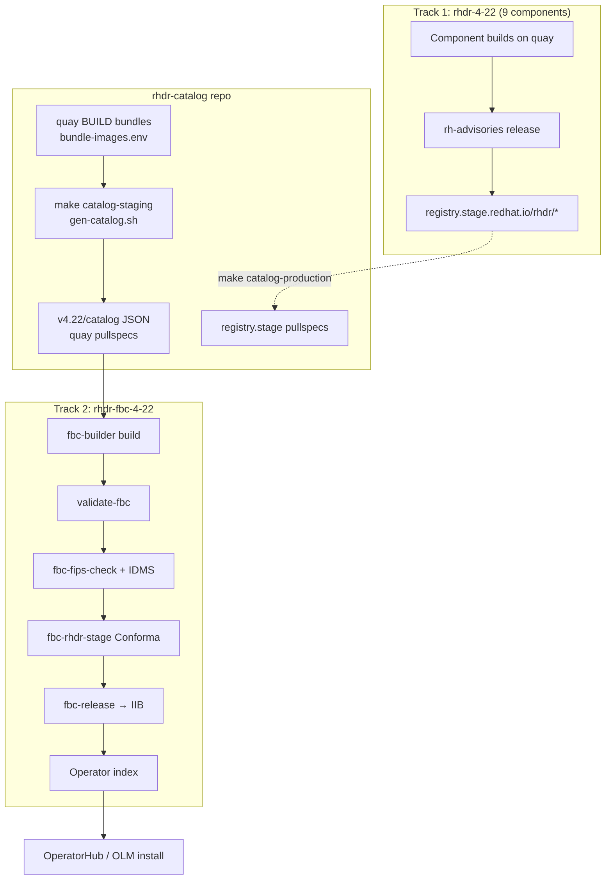

# RHDR FBC Application — GitOps Setup Guide

**Status:** Implemented — catalog tooling, IDMS, and local make targets verified; Konflux pipeline validation in progress  
**Pattern reference:** RHODF `rhodf/konflux/rhodf-fbc` (per-version subdirectory) + RHWA registry rewrite workflow  
**Konflux tenant:** `rhdr-tenant` on `stone-prod-p02`  
**Related:** [CreateRHDRFBCApplication.md](./CreateRHDRFBCApplication.md), [RHDRCatalog.md](./RHDRCatalog.md), [RHDRReleasePlanAdmissionRequirements.md](./RHDRReleasePlanAdmissionRequirements.md)

---

## Overview

RHDR is a **Tech Preview** product with a **single active version** (`4.22`). There is **no upgrade path** in the FBC catalog: each operator has one `stable-4.22` channel entry and one bundle reference. Updates replace the bundle digest — no `replaces` / `skipRange` chains.

The **File-Based Catalog (FBC)** aggregates **four** RHDR operator bundles into one OLM catalog image. After release via the `fbc-release` pipeline, the catalog fragment is submitted to IIB and published to the Red Hat operator index.

### Scope: 9 Konflux components, 11 Pyxis repos, 4 FBC packages

| Layer | Count | What |
|-------|-------|------|
| **Konflux build components** (`rhdr-4-22`) | 9 | All images built and released via `rh-advisories` |
| **Pyxis repositories** (`rhdr.yaml`) | 11 | Includes hub/cluster controllers shipped inside bundles (no separate Konflux component) |
| **FBC catalog packages** (`catalog.json`) | 4 | Operator bundles with `fbc_opt_in: true` |

**4 operator bundles in FBC** (`fbc_opt_in: true` in [rhdr.yaml](https://gitlab.cee.redhat.com/rhtap-releng/pyxis-repo-configs/-/blob/main/products/rhdr/rhdr.yaml)):

| Pyxis repo | Konflux component | OLM package (`allowedPackages`) |
|------------|-------------------|--------------------------------|
| `rhdr/rhdr-hub-operator-bundle` | `rhdr-hub-operator-bundle-4-22` | `rhdr-hub-operator` |
| `rhdr/rhdr-cluster-operator-bundle` | `rhdr-cluster-operator-bundle-4-22` | `rhdr-cluster-operator` |
| `rhdr/rhdr-multicluster-operator-bundle` | `rhdr-multicluster-operator-bundle-4-22` | `rhdr-multicluster-operator` |
| `rhdr/rhdr-csi-addons-operator-bundle` | `rhdr-csi-addons-operator-bundle-4-22` | `rhdr-csi-addons-operator` |

**Not in FBC** (released via `rhdr-4-22-stage`, referenced as `relatedImages` in bundle CSVs):

- 4 operator controllers: `rhdr-hub-rhel9-operator`, `rhdr-cluster-rhel9-operator`, `rhdr-multicluster-rhel9-operator`, `rhdr-csi-addons-rhel9-operator`
- 3 layered images: sidecar, ramen base image, console

Package names in `catalog.json` and `allowedPackages` **must match** the `metadata.name` / `packageName` in each bundle CSV — verify in source repos; do not guess.

---

## Two separate RPAs (do not merge)

RHDR needs **two** ReleasePlanAdmission resources for **two** Konflux applications:

| RPA | Application | Pipeline | Purpose |
|-----|-------------|----------|---------|
| **`rhdr-4-22-stage`** ✅ exists | `rhdr-4-22` | `rh-advisories` | Publishes all **9** container images to `registry.stage.redhat.io/rhdr/…` |
| **`rhdr-fbc-4-22-stage`** ✅ branch ready | `rhdr-fbc-4-22` | `fbc-release` | Submits FBC fragment to IIB → staged operator index |

- **RPA 1** maps every Konflux component to its staging registry repo (see [rhdr-4-22-stage.yaml](https://gitlab.cee.redhat.com/rhtap-releng/konflux-release-data/-/blob/main/config/stone-prod-p02.hjvn.p1/product/ReleasePlanAdmission/rhdr/rhdr-4-22-stage.yaml)).
- **RPA 2** lists only the **4 OLM package names** in `fbc.allowedPackages` and targets the FBC application. Model on [rhwa-fbc-stage.yaml](https://gitlab.cee.redhat.com/rhtap-releng/konflux-release-data/-/blob/main/config/stone-prod-p02.hjvn.p1/product/ReleasePlanAdmission/rhwa/rhwa-fbc-stage.yaml).

---

## Reference patterns: RHWA vs RHODF

| Aspect | RHWA (`dragonfly/rhwa-fbc`) | RHODF (`rhodf/konflux/rhodf-fbc`) | **RHDR choice** |
|--------|----------------------------|-----------------------------------|-----------------|
| Versions | Many parallel (`rhwa-fbc-422`, …) | One folder per OCP minor | **Single version** (`4.22`) |
| Catalog layout | `Containerfile.rhwa-fbc-422-catalog` on `main` | `v4.22/` subdirectory + shared `catalog.Dockerfile` | **RHODF** subdirectory pattern |
| Konflux naming | `rhwa-fbc-422` (no dot) | `rhodf-fbc-4-22` (with dot) | **`rhdr-fbc-4-22`** (RHODF pattern) |
| GitOps layout | PDS template | `fbc-fragments/4-22/fbc-4-22.yaml` | **`fbc-fragments/4-22/fbc-4-22.yaml`** |
| Stage RPA | One shared `rhwa-fbc-stage` for many apps | One RPA per FBC app | **`rhdr-fbc-4-22-stage`** |

---

## End-to-end release flow



1. **Track 1** builds and releases container images to the staging registry.
2. **Catalog repo** regenerates FBC JSON from quay BUILD bundles (`make catalog-staging`) during development.
3. **Track 2** builds the catalog image, runs Conforma, and publishes the index fragment.
4. After stage release, optionally run `make catalog-production` to swap quay → `registry.stage.redhat.io` pullspecs.

Controller, sidecar, ramen, and console images are pulled via `relatedImages` — they are **not** separate FBC packages.

---

## Step 1: Create the GitLab repo for the FBC

Create **`https://gitlab.cee.redhat.com/rh-ocp-dr/rhdr-catalog`** (or `rh-ocp-dr/rhdr-fbc` if your group policy requires it — keep URL consistent with the Konflux `Component` spec).

### Repository layout (RHODF single-version + RHWA registry tooling)

```
rhdr-catalog/
├── Makefile
├── bundle-images.env              # quay @sha256 digests (4 bundle components)
├── image-mappings.env             # prod/stage/build registry map (no guessed paths)
├── README.md
├── scripts/
│   ├── gen-catalog.sh             # --mode=staging | --mode=production
│   ├── opm-container.sh           # opm wrapper (auth + policy.json)
│   └── update-bundle-json.sh      # wrapper → gen-catalog.sh
├── v4.22/
│   ├── catalog.Dockerfile
│   └── catalog/
│       ├── rhdr-hub-operator/
│       │   ├── package.json
│       │   ├── channels/stable-4.22.json
│       │   └── bundles/*.json
│       ├── rhdr-cluster-operator/ …
│       ├── rhdr-multicluster-operator/ …
│       └── rhdr-csi-addons-operator/ …
└── .tekton/
    ├── rhdr-fbc-4-22-on-push.yaml
    ├── rhdr-fbc-4-22-on-pull-request.yaml
    └── images-mirror-set.yaml     # IDMS for FIPS check
```

**Reference repos:**

- RHWA: [dragonfly/rhwa-fbc](https://gitlab.cee.redhat.com/dragonfly/rhwa-fbc) — registry rewrite (`fix_prod_image` / staging workflow)
- RHODF: [rhodf/konflux/rhodf-fbc](https://gitlab.cee.redhat.com/rhodf/konflux/rhodf-fbc) — `v4.22/` split JSON layout

### `catalog.Dockerfile` (in `v4.22/`)

```dockerfile
FROM registry.redhat.io/openshift4/ose-operator-registry-rhel9:v4.22
ENTRYPOINT ["/bin/opm"]
CMD ["serve", "/configs", "--cache-dir=/tmp/cache"]
ADD catalog /configs
RUN ["/bin/opm", "serve", "/configs", "--cache-dir=/tmp/cache", "--cache-only"]
LABEL operators.operatorframework.io.index.configs.v1=/configs
```

### Declarative catalog (`v4.22/catalog/`)

Per operator package directory: `package.json`, `channels/stable-4.22.json` (single entry, no upgrade), and `bundles/*.json`.

**Do not hand-edit bundle JSON.** Regenerate with:

```bash
# Update bundle-images.env with quay digests first
make catalog-staging
make validate
make build
```

`gen-catalog.sh --mode=staging`:

- Renders from quay bundle images (`bundle-images.env`)
- Converts `olm.bundle.object` → `olm.csv.metadata` (OCP 4.22)
- Rewrites prod/stage/legacy registry refs → quay BUILD per `image-mappings.env`

Registry paths in `image-mappings.env` are derived only from `rhdr.yaml`, `rhdr-4-22-stage` RPA, and `rhdr-4-22.yaml`.

### Tekton PAC

| Field | Value |
|-------|-------|
| `metadata.labels.appstudio.openshift.io/application` | `rhdr-fbc-4-22` |
| `metadata.labels.appstudio.openshift.io/component` | `rhdr-fbc-4-22` |
| `metadata.name` | `rhdr-fbc-4-22-on-push` |
| `metadata.namespace` | `rhdr-tenant` |
| `params.path-context` | `v4.22` |
| `params.dockerfile` | `catalog.Dockerfile` |
| `run-opm-command.IDMS_PATH` | `.tekton/images-mirror-set.yaml` |

PAC CEL triggers on `v4.22/**` and `.tekton/**` changes (including IDMS).

---

## Step 2: Konflux Application & Component (GitOps)

Add under `tenants-config/cluster/stone-prod-p02/tenants/rhdr-tenant/fbc-fragments/4-22/fbc-4-22.yaml` and list `fbc-fragments` in `kustomization.yaml`.

### Application

```yaml
apiVersion: appstudio.redhat.com/v1alpha1
kind: Application
metadata:
  name: rhdr-fbc-4-22
  namespace: rhdr-tenant
spec:
  displayName: "RHDR catalog 4.22"
```

### Component

```yaml
apiVersion: appstudio.redhat.com/v1alpha1
kind: Component
metadata:
  name: rhdr-fbc-4-22
  namespace: rhdr-tenant
  annotations:
    build.appstudio.openshift.io/request: configure-pac
    build.appstudio.openshift.io/pipeline: '{"name":"fbc-builder","bundle":"latest"}'
spec:
  application: rhdr-fbc-4-22
  componentName: rhdr-fbc-4-22
  source:
    git:
      revision: main
      url: https://gitlab.cee.redhat.com/rh-ocp-dr/rhdr-catalog
      dockerfileUrl: catalog.Dockerfile
      context: v4.22
```

> **Critical:** The `build.appstudio.openshift.io/pipeline` annotation selects **`fbc-builder`**, not the default `docker-build`. Without it, the FBC will not build correctly.

Build output (dev): `quay.io/redhat-user-workloads/rhdr-tenant/rhdr-fbc/rhdr-fbc-4-22`

---

## Step 3: IntegrationTestScenario (Conforma)

```yaml
apiVersion: appstudio.redhat.com/v1beta2
kind: IntegrationTestScenario
metadata:
  labels:
    test.appstudio.openshift.io/optional: "false"
  name: rhdr-fbc-4-22-enterprise-contract
  namespace: rhdr-tenant
spec:
  application: rhdr-fbc-4-22
  contexts:
    - name: application
      description: execute the integration test when component rhdr-fbc-4-22 updates
  params:
    - name: POLICY_CONFIGURATION
      value: rhtap-releng-tenant/fbc-rhdr-stage
    - name: TIMEOUT
      value: 10m0s
  resolverRef:
    params:
      - name: url
        value: https://github.com/redhat-appstudio/build-definitions
      - name: revision
        value: main
      - name: pathInRepo
        value: pipelines/enterprise-contract.yaml
    resolver: git
```

---

## Step 4: ReleasePlan (tenant namespace)

```yaml
apiVersion: appstudio.redhat.com/v1alpha1
kind: ReleasePlan
metadata:
  labels:
    release.appstudio.openshift.io/auto-release: "false"
    release.appstudio.openshift.io/releasePlanAdmission: rhdr-fbc-4-22-stage
    release.appstudio.openshift.io/standing-attribution: "true"
  name: rhdr-fbc-4-22-stage-release-plan
  namespace: rhdr-tenant
spec:
  application: rhdr-fbc-4-22
  target: rhtap-releng-tenant
```

`auto-release: "false"` requires manual stage release approval (current setting in `fbc-4-22.yaml`).

Add a prod ReleasePlan + `rhdr-fbc-prod` RPA when ready for production index publish.

---

## Step 5: EnterpriseContractPolicy (managed namespace)

Create `config/stone-prod-p02.hjvn.p1/product/EnterpriseContractPolicy/fbc-rhdr-stage.yaml`:

```yaml
apiVersion: appstudio.redhat.com/v1alpha1
kind: EnterpriseContractPolicy
metadata:
  name: fbc-rhdr-stage
  namespace: rhtap-releng-tenant
  annotations:
    konflux-release-data/derived-from: fbc-stage
spec:
  description: 'Includes rules for shipping RHDR FBC fragments'
  publicKey: 'k8s://openshift-pipelines/public-key'
  sources:
    - name: Release Policies
      ruleData:
        allowed_olm_image_registry_prefixes:
          - registry.stage.redhat.io/
          - brew.registry.redhat.io/rh-osbs/openshift-ose-operator-registry-rhel9
          - quay.io/redhat-user-workloads/rhdr-tenant/
      data:
        - github.com/release-engineering/rhtap-ec-policy//data
        - oci::quay.io/konflux-ci/tekton-catalog/data-acceptable-bundles:latest
        - oci::quay.io/konflux-ci/konflux-vanguard/data-acceptable-bundles:latest
        - oci::quay.io/konflux-ci/integration-service-catalog/data-acceptable-bundles:latest
      policy:
        - oci::quay.io/conforma/release-policy:konflux
      config:
        include:
          - '@redhat'
        exclude:
          - cve
          - step_image_registries
          - source_image.exists
          - olm.inaccessible_related_images
          - schedule.weekday_restriction
```

Include `quay.io/redhat-user-workloads/rhdr-tenant/` so the FBC can reference Konflux build output during development. Standard FBC excludes match RHWA.

Constraint file `constraints/product/rhdr.yaml` already permits `fbc-rhdr-stage` / `fbc-rhdr-prod`.

---

## Step 6: ReleasePlanAdmission for FBC (managed namespace)

Actual file: `config/stone-prod-p02.hjvn.p1/product/ReleasePlanAdmission/rhdr/rhdr-fbc-4-22-stage.yaml`

Key fields:

| Field | Value |
|-------|-------|
| `metadata.name` | `rhdr-fbc-4-22-stage` |
| `spec.policy` | `fbc-rhdr-stage` |
| `spec.applications` | `rhdr-fbc-4-22` |
| `spec.origin` | `rhdr-tenant` |
| `product_id` | `1119` |
| `allowedPackages` | `rhdr-hub-operator`, `rhdr-cluster-operator`, `rhdr-multicluster-operator`, `rhdr-csi-addons-operator` |
| Pipeline | `pipelines/managed/fbc-release/fbc-release.yaml` |

---

## Step 7: Pyxis `fbc_opt_in` (first release)

All **four** bundle repos in [rhdr.yaml](https://gitlab.cee.redhat.com/rhtap-releng/pyxis-repo-configs/-/blob/main/products/rhdr/rhdr.yaml) already have `fbc_opt_in: true` — no separate Pyxis request needed for first FBC release.

IIB will refuse to publish if `fbc_opt_in` is missing on any bundle referenced by the catalog.

---

## Summary of merge requests

Submit as a **single MR** on `konflux-release-data` containing both tenant and product config:

| Area | Resources |
|------|-----------|
| **Tenant config** (`tenants-config/.../rhdr-tenant/`) | Application `rhdr-fbc-4-22`, Component (with `fbc-builder`), IntegrationTestScenario, ReleasePlan |
| **Product config** (`config/stone-prod-p02.hjvn.p1/product/`) | `fbc-rhdr-stage` ECP, `rhdr-fbc-4-22-stage` RPA |
| **CODEOWNERS** | Entries for new paths |

```bash
cd tenants-config
./build-single.sh rhdr-tenant   # or ./build-manifests.sh
cd ..
tox   # runs all tests including tenants-config-test and schema validation
```

Commit **both** `cluster/` source and `auto-generated/` output.

> **Note:** The initial implementation used two separate MRs/branches (`rhdr-fbc-4-22-tenant-config` for tenant config, `rhdr-fbc-4-22-releng-config` for ECP+RPA). This was unnecessary — a single MR is simpler and preferred.

### Separately — FBC source repo

Create `rhdr-catalog` with `v4.22/catalog/`, `catalog.Dockerfile`, and `.tekton/` PAC definitions.

---

## Prerequisites

1. **`rhdr-4-22`** application builds all 9 components ([rhdr-4-22.yaml](https://gitlab.cee.redhat.com/rhtap-releng/konflux-release-data/-/blob/main/tenants-config/cluster/stone-prod-p02/tenants/rhdr-tenant/rhdr-4-22.yaml)).
2. **`rhdr-4-22-stage` RPA** publishes images to `registry.stage.redhat.io/rhdr/…`.
3. At least one successful bundle release so `catalog.json` can reference real `@sha256:` digests.

---

## Update flow (single version)

| Step | Action |
|------|--------|
| 1 | Merge component fixes → `rhdr-4-22` builds on quay |
| 2 | Resolve quay digests per bundle (`skopeo inspect ...:v4.22.0-XX`) |
| 3 | Update `bundle-images.env` in `rhdr-catalog` |
| 4 | `make catalog-staging && make validate && make build` |
| 5 | Commit and push `rhdr-catalog` → PAC runs `fbc-builder` |
| 6 | Conforma (`fbc-rhdr-stage`) passes → FBC release to operator index |
| 7 | Validate operators in test cluster |

**Staging workflow (now):** catalog uses quay BUILD pullspecs — allowed by `fbc-rhdr-stage` ECP.

**Production workflow (after stage release):** `make catalog-production` swaps quay → `registry.stage.redhat.io` per `rhdr-4-22-stage` RPA.

**No upgrade graph:** replace the bundle digest in the existing `stable-4.22` channel entry only.

---

## Verification

### Local

```bash
cd rhdr-catalog
make catalog-staging
make validate
make build

# Sanity checks
jq -r '.image' v4.22/catalog/*/bundles/*.json
# Expect: quay.io/redhat-user-workloads/rhdr-tenant/rhdr/*
```

Prerequisites: `podman login registry.redhat.io` and quay auth (see `scripts/opm-container.sh`).

### After Konflux build

```bash
skopeo inspect docker://quay.io/redhat-user-workloads/rhdr-tenant/rhdr-fbc/rhdr-fbc-4-22@sha256:<digest>
```

### OLM smoke test

```bash
kubectl get packagemanifests -n openshift-marketplace | grep rhdr
```

Expect: `rhdr-hub-operator`, `rhdr-cluster-operator`, `rhdr-multicluster-operator`, `rhdr-csi-addons-operator`.

---

## Implementation status

### Done

| Item | Status | Detail |
|------|--------|--------|
| FBC GitLab repo | **Done** | `rh-ocp-dr/rhdr-catalog` on `main` |
| Catalog scaffolding | **Done** | RHODF split JSON, `catalog.Dockerfile`, `.tekton/` PAC |
| Catalog tooling | **Done** | `Makefile`, `gen-catalog.sh`, `bundle-images.env`, `image-mappings.env` |
| Registry mapping | **Done** | Paths from `rhdr.yaml`, `rhdr-4-22-stage` RPA, `rhdr-4-22.yaml` only |
| `opm-container.sh` | **Done** | Auth + `policy.json` for quay pulls (RHWA pattern) |
| IDMS | **Done** | `.tekton/images-mirror-set.yaml`, `IDMS_PATH` in PAC |
| Channel / packages | **Done** | `stable-4.22`, OLM names `rhdr-*` match `allowedPackages` |
| Bundle rebrand (4 repos) | **Done** | OLM package names `rhdr-*` on `4.22` branch |
| Tenant GitOps | **Done** | `fbc-fragments/4-22/fbc-4-22.yaml` merged |
| Releng ECP + RPA | **Done** | `fbc-rhdr-stage`, `rhdr-fbc-4-22-stage` |
| Pyxis `fbc_opt_in` | **Done** | All 4 bundles in `rhdr.yaml` |
| Local validation | **Done** | `make catalog-staging`, `make validate`, `make build` pass |

### Remaining

| Item | Blocked on | Action |
|------|-----------|--------|
| Konflux pipeline green | Push updated catalog | Verify `validate-fbc` + Conforma pass |
| Stage FBC release | Conforma pass | Approve stage Release (`auto-release: false`) |
| OLM validation | Stage release | `kubectl get packagemanifests \| grep rhdr` |
| `catalog-production` | `rhdr-4-22-stage` images on registry.stage | Run after container stage release |

### Deferred (CPaaS legacy scripts)

The `pre_render_templates` and `render_fdf_templates` scripts in bundle repos still contain old ODF/ODR package names. Not used by Konflux.

---

## Implementation branches

| Repo | Branch | Push status | Contents |
|------|--------|-------------|----------|
| `rh-ocp-dr/rhdr-catalog` | `main` | **Pushed** | Catalog + PAC |
| `konflux-release-data` | `rhdr-fbc-4-22-combined` | **Pushed** (open MR) | Tenant GitOps + ECP + RPA (all in one) |
| `rhdr-hub-operator-bundle` | `4.22` | **Pushed** | Rebrand + script fix |
| `rhdr-csi-addons-operator-bundle` | `4.22` | **Pushed** | Rebrand + script fix |
| `rhdr-multicluster-operator-bundle` | `4.22` | **Pushed** | Rebrand + script fix |
| `rhdr-cluster-operator-bundle` | `4.22` | **Pushed** | Rebrand + script fix |

---

## Post-merge runbook (first FBC release)

1. Verify `rhdr-fbc-4-22` Application/Component synced in `rhdr-tenant`.
2. Confirm all 4 bundle components built on quay with `rhdr-*` package names.
3. Update `bundle-images.env` with quay `@sha256` digests (use version tags, not staging digests).
4. Run `make catalog-staging && make validate && make build` in `rhdr-catalog`.
5. Commit and push catalog changes to `rh-ocp-dr/rhdr-catalog`.
6. PAC triggers `rhdr-fbc-4-22-on-push` → `validate-fbc` → `fbc-fips-check` → Conforma.
7. Manually create/approve **stage Release** (`auto-release: false` on ReleasePlan).
8. Validate: `kubectl get packagemanifests -n openshift-marketplace | grep rhdr`

When Track 1 releases new bundles, update `bundle-images.env` and re-run `make catalog-staging`.

---

## Checklist

### GitLab (`rhdr-catalog`)

- [x] Repo with `v4.22/catalog/`, `catalog.Dockerfile`, `.tekton/`
- [x] `Makefile`, `gen-catalog.sh`, `bundle-images.env`, `image-mappings.env`
- [x] Channel `stable-4.22`, OLM packages `rhdr-*`
- [x] IDMS `images-mirror-set.yaml`
- [x] PAC CEL triggers fixed
- [x] Local `make catalog-staging`, `make validate`, `make build` verified
- [ ] Konflux pipeline green (validate-fbc + Conforma)

### Bundle repos (OLM rebrand)

- [x] `rhdr-hub-operator-bundle` — `odr-hub-operator` → `rhdr-hub-operator` (pushed)
- [x] `rhdr-csi-addons-operator-bundle` — `odf-csi-addons-operator` → `rhdr-csi-addons-operator` (pushed)
- [x] `rhdr-multicluster-operator-bundle` — `odf-multicluster-orchestrator` → `rhdr-multicluster-operator` (pushed)
- [x] `rhdr-cluster-operator-bundle` — `rhdr-cluster-operator-bundle` → `rhdr-cluster-operator` (pushed)
- [x] `update_bundle.sh` / `test_update_bundle.sh` fixed in all repos (pushed)
- [ ] Konflux rebuilds bundles with new package names
- [ ] Stage release publishes rebranded bundles to `registry.stage.redhat.io`

### Tenant GitOps (MR 1)

- [x] `fbc-fragments/4-22/fbc-4-22.yaml`
- [x] `kustomization.yaml` updated + auto-generated committed
- [x] MR !19991 merged

### Releng config

- [x] `fbc-rhdr-stage` ECP (allows quay BUILD + stage + prod prefixes)
- [x] `rhdr-fbc-4-22-stage` RPA with 4 `allowedPackages` (rhdr-* names)
- [x] `tox -e test` passes
- [x] Merged to `konflux-release-data` main

### Existing (already done)

- [x] `rhdr-4-22-stage` RPA — all 9 components → `registry.stage.redhat.io`
- [x] Pyxis `fbc_opt_in: true` on all 4 bundles

---

## Where to get help

- **#konflux-users** — FBC onboarding, RPA/ECP review, release pipeline issues
- **Releng IC** — RPA and ECP merge approvals
- **Pyxis** — only if `fbc_opt_in` is missing (already set for RHDR)

---

## Reference paths

| Resource | Path |
|----------|------|
| RHDR pyxis product | `pyxis-repo-configs/products/rhdr/rhdr.yaml` |
| Container RPA (9 components) | `config/.../ReleasePlanAdmission/rhdr/rhdr-4-22-stage.yaml` |
| FBC RPA | `config/.../ReleasePlanAdmission/rhdr/rhdr-fbc-4-22-stage.yaml` |
| RHODF FBC GitOps | `tenants-config/.../rhodf-tenant/fbc-fragments/4-22/fbc-4-22.yaml` |
| RHDR constraints | `constraints/product/rhdr.yaml` |

---

## Related JIRA

- [VIRTDR-141](https://redhat.atlassian.net/browse/VIRTDR-141) — Konflux tenant setup

---

## Progress log (2026-07-13)

### Catalog implementation

- [x] `Makefile` with `catalog-staging`, `catalog-production`, `validate`, `build`
- [x] `gen-catalog.sh` — quay render + `olm.csv.metadata` migration + registry rewrite
- [x] `image-mappings.env` — prod/stage/build paths from authoritative GitOps/Pyxis only
- [x] `opm-container.sh` — auth + `policy.json` for in-container quay pulls (RHWA pattern)
- [x] `.tekton/images-mirror-set.yaml` — IDMS for FIPS check fallback
- [x] PAC CEL filename fixes + IDMS in path triggers
- [x] Channel renamed to `stable-4.22`
- [x] Local workflow verified: `make catalog-staging && make validate && make build`

### Remaining

1. Push catalog changes to `rh-ocp-dr/rhdr-catalog`
2. Verify Konflux `rhdr-fbc-4-22-on-push` pipeline passes
3. Approve stage FBC release
4. OLM smoke test on test cluster

---

## Progress log (2026-07-07)

### Done

- [x] FBC GitLab repo `rh-ocp-dr/rhdr-catalog` created and pushed (`main`)
- [x] Catalog scaffolding: `v4.22/catalog/`, `catalog.Dockerfile`, `.tekton/` PAC definitions
- [x] OLM package rebrand in all 4 bundle repos (pushed to `4.22` branch):
  - `rhdr-hub-operator-bundle`: `odr-hub-operator` → `rhdr-hub-operator`
  - `rhdr-csi-addons-operator-bundle`: `odf-csi-addons-operator` → `rhdr-csi-addons-operator`
  - `rhdr-multicluster-operator-bundle`: `odf-multicluster-orchestrator` → `rhdr-multicluster-operator`
  - `rhdr-cluster-operator-bundle`: `rhdr-cluster-operator-bundle` → `rhdr-cluster-operator`
- [x] Konflux `update_bundle.sh` / `test_update_bundle.sh` fixed to match new CSV filenames (pushed)
- [x] Pyxis `fbc_opt_in: true` on all 4 bundles (already set)
- [x] Combined `konflux-release-data` branch `rhdr-fbc-4-22-combined` pushed — includes:
  - Tenant GitOps: Application, Component (`fbc-builder`), IntegrationTestScenario, ReleasePlan
  - Releng config: `fbc-rhdr-stage` ECP + `rhdr-fbc-4-22-stage` RPA with `rhdr-*` `allowedPackages`
  - `tox -e test` passes (no uniqueness conflicts with RHODF)
  - MR URL: https://gitlab.cee.redhat.com/releng/konflux-release-data/-/merge_requests/new?merge_request%5Bsource_branch%5D=rhdr-fbc-4-22-combined
- [x] Old MRs !19991 and !20017 superseded — close them after the combined MR is opened

### Left to do

1. **Open MR** from `rhdr-fbc-4-22-combined` branch on `konflux-release-data` and get releng approval
2. **Close** old MRs !19991 and !20017
3. **Wait for Konflux** to rebuild all 4 bundles with new `rhdr-*` package names (PAC should trigger on the pushed `4.22` branches)
4. **Verify stage release** publishes rebranded bundles to `registry.stage.redhat.io`
5. **Regenerate FBC catalog JSON** — run `./scripts/update-bundle-json.sh` in `rhdr-catalog` to pick up new digests from staging
6. **Push updated catalog** — commit and push new `bundles/*.json` to `rh-ocp-dr/rhdr-catalog`
7. **Verify ArgoCD sync** — confirm `rhdr-fbc-4-22` Application/Component appear in `rhdr-tenant` namespace
8. **Verify PAC webhook** — confirm `rhdr-fbc-4-22-on-push` PipelineRun triggers and succeeds
9. **Verify Conforma** — `fbc-rhdr-stage` policy passes against the built FBC image
10. **Create stage Release** — manually approve (ReleasePlan has `auto-release: false`)
11. **OLM validation** — `kubectl get packagemanifests -n openshift-marketplace | grep rhdr`

### Deferred

- CPaaS/dist-git `pre_render_templates` and `render_fdf_templates` scripts still reference old ODF/ODR names — will be updated when CPaaS is fully retired
