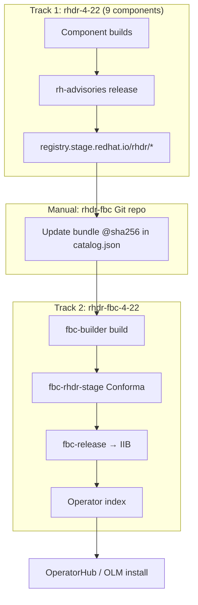

# RHDR FBC Application — GitOps Setup Guide

**Status:** In progress — bundle rebrand complete, awaiting Konflux rebuilds and MR merges  
**Pattern reference:** RHODF `rhodf/konflux/rhodf-fbc` (per-version subdirectory) — **not** RHWA multi-version `ProjectDevelopmentStream`  
**Konflux tenant:** `rhdr-tenant` on `stone-prod-p02`  
**Related:** [RHDRCatalog.md](./RHDRCatalog.md), [RHDRReleasePlanAdmissionRequirements.md](./RHDRReleasePlanAdmissionRequirements.md)

---

## Overview

RHDR is a **Tech Preview** product with a **single active version** (`4.22`). There is **no upgrade path** in the FBC catalog: each operator has one `stable` channel entry and one bundle reference. Updates replace the bundle digest — no `replaces` / `skipRange` chains.

The **File-Based Catalog (FBC)** aggregates **four** RHDR operator bundles into one OLM catalog image. After release via the `fbc-release` pipeline, the catalog fragment is submitted to IIB and published to the Red Hat operator index.

### Scope: 9 Konflux components, 11 Pyxis repos, 4 FBC packages

| Layer | Count | What |
|-------|-------|------|
| **Konflux build components** (`rhdr-4-22`) | 9 | All images built and released via `rh-advisories` |
| **Pyxis repositories** (`rhdr.yaml`) | 11 | Includes hub/cluster controllers shipped inside bundles (no separate Konflux component) |
| **FBC catalog packages** (`catalog.json`) | 4 | Operator bundles with `fbc_opt_in: true` |

**4 operator bundles in FBC** (`fbc_opt_in: true` in [rhdr.yaml](https://gitlab.cee.redhat.com/rhtap-releng/pyxis-repo-configs/-/blob/main/products/rhdr/rhdr.yaml)):

| Pyxis repo | Konflux component | OLM package (`allowedPackages`) |
|------------|-------------------|--------------------------------|
| `rhdr/rhdr-hub-operator-bundle` | `rhdr-hub-operator-bundle-4-22` | `rhdr-hub-operator` |
| `rhdr/rhdr-cluster-operator-bundle` | `rhdr-cluster-operator-bundle-4-22` | `rhdr-cluster-operator` |
| `rhdr/rhdr-multicluster-operator-bundle` | `rhdr-multicluster-operator-bundle-4-22` | `rhdr-multicluster-operator` |
| `rhdr/rhdr-csi-addons-operator-bundle` | `rhdr-csi-addons-operator-bundle-4-22` | `rhdr-csi-addons-operator` |

**Not in FBC** (released via `rhdr-4-22-stage`, referenced as `relatedImages` in bundle CSVs):

- 4 operator controllers: `rhdr-hub-rhel9-operator`, `rhdr-cluster-rhel9-operator`, `rhdr-multicluster-rhel9-operator`, `rhdr-csi-addons-rhel9-operator`
- 3 layered images: sidecar, ramen base image, console

Package names in `catalog.json` and `allowedPackages` **must match** the `metadata.name` / `packageName` in each bundle CSV — verify in source repos; do not guess.

---

## Two separate RPAs (do not merge)

RHDR needs **two** ReleasePlanAdmission resources for **two** Konflux applications:

| RPA | Application | Pipeline | Purpose |
|-----|-------------|----------|---------|
| **`rhdr-4-22-stage`** ✅ exists | `rhdr-4-22` | `rh-advisories` | Publishes all **9** container images to `registry.stage.redhat.io/rhdr/…` |
| **`rhdr-fbc-4-22-stage`** ✅ branch ready | `rhdr-fbc-4-22` | `fbc-release` | Submits FBC fragment to IIB → staged operator index |

- **RPA 1** maps every Konflux component to its staging registry repo (see [rhdr-4-22-stage.yaml](https://gitlab.cee.redhat.com/rhtap-releng/konflux-release-data/-/blob/main/config/stone-prod-p02.hjvn.p1/product/ReleasePlanAdmission/rhdr/rhdr-4-22-stage.yaml)).
- **RPA 2** lists only the **4 OLM package names** in `fbc.allowedPackages` and targets the FBC application. Model on [rhwa-fbc-stage.yaml](https://gitlab.cee.redhat.com/rhtap-releng/konflux-release-data/-/blob/main/config/stone-prod-p02.hjvn.p1/product/ReleasePlanAdmission/rhwa/rhwa-fbc-stage.yaml).

---

## Reference patterns: RHWA vs RHODF

| Aspect | RHWA (`dragonfly/rhwa-fbc`) | RHODF (`rhodf/konflux/rhodf-fbc`) | **RHDR choice** |
|--------|----------------------------|-----------------------------------|-----------------|
| Versions | Many parallel (`rhwa-fbc-422`, …) | One folder per OCP minor | **Single version** (`4.22`) |
| Catalog layout | `Containerfile.rhwa-fbc-422-catalog` on `main` | `v4.22/` subdirectory + shared `catalog.Dockerfile` | **RHODF** subdirectory pattern |
| Konflux naming | `rhwa-fbc-422` (no dot) | `rhodf-fbc-4-22` (with dot) | **`rhdr-fbc-4-22`** (RHODF pattern) |
| GitOps layout | PDS template | `fbc-fragments/4-22/fbc-4-22.yaml` | **`fbc-fragments/4-22/fbc-4-22.yaml`** |
| Stage RPA | One shared `rhwa-fbc-stage` for many apps | One RPA per FBC app | **`rhdr-fbc-4-22-stage`** |

---

## End-to-end release flow



1. **Track 1** releases bundle images to the staging registry.
2. **You** copy bundle digests into `rhdr-fbc/v4.22/catalog/*/bundles/*.json`.
3. **Track 2** builds the catalog image and publishes the index fragment.
4. Controller, sidecar, ramen, and console images are pulled via `relatedImages` when users install operators — they are **not** separate FBC packages.

---

## Step 1: Create the GitLab repo for the FBC

Create **`https://gitlab.cee.redhat.com/rh-ocp-dr/rhdr-catalog`** (or `rh-ocp-dr/rhdr-fbc` if your group policy requires it — keep URL consistent with the Konflux `Component` spec).

### Repository layout (RHODF single-version pattern)

```
rhdr-fbc/
├── v4.22/
│   ├── catalog.Dockerfile
│   └── catalog/
│       ├── rhdr-hub-operator/
│       │   ├── package.json
│       │   ├── channels/stable.json
│       │   └── bundles/rhdr-hub-operator.v4.22.0.json
│       ├── rhdr-cluster-operator/ …
│       ├── rhdr-multicluster-operator/ …
│       └── rhdr-csi-addons-operator/ …
└── .tekton/
    ├── rhdr-fbc-4-22-on-push.yaml
    └── rhdr-fbc-4-22-on-pull-request.yaml
```

**Reference repos:**

- RHWA: [dragonfly/rhwa-fbc](https://gitlab.cee.redhat.com/dragonfly/rhwa-fbc) — per-version Containerfiles on `main`
- RHODF: [rhodf/konflux/rhodf-fbc](https://gitlab.cee.redhat.com/rhodf/konflux/rhodf-fbc) — `v4.22/` subdirectories

### `catalog.Dockerfile` (in `v4.22/`)

```dockerfile
FROM registry.redhat.io/openshift4/ose-operator-registry-rhel9:v4.22
ENTRYPOINT ["/bin/opm"]
CMD ["serve", "/configs", "--cache-dir=/tmp/cache"]
ADD catalog /configs
RUN ["/bin/opm", "serve", "/configs", "--cache-dir=/tmp/cache", "--cache-only"]
LABEL operators.operatorframework.io.index.configs.v1=/configs
```

### Declarative catalog (`v4.22/catalog/`)

Per operator package directory: `package.json`, `channels/stable.json` (single entry, no upgrade), and `bundles/*.json` with staging registry digest pullspecs.

Validate: `cd v4.22 && opm validate catalog/`

### Tekton PAC

Copy `.tekton/rhodf-fbc-4-22-on-push.yaml` or `rhwa-fbc-422` PAC files and set:

| Field | Value |
|-------|-------|
| `metadata.labels.appstudio.openshift.io/application` | `rhdr-fbc-4-22` |
| `metadata.labels.appstudio.openshift.io/component` | `rhdr-fbc-4-22` |
| `metadata.name` | `rhdr-fbc-4-22-on-push` |
| `metadata.namespace` | `rhdr-tenant` |
| `params.path-context` | `v4.22` |
| `params.dockerfile` | `catalog.Dockerfile` |

---

## Step 2: Konflux Application & Component (GitOps)

Add under `tenants-config/cluster/stone-prod-p02/tenants/rhdr-tenant/fbc-fragments/4-22/fbc-4-22.yaml` and list `fbc-fragments` in `kustomization.yaml`.

### Application

```yaml
apiVersion: appstudio.redhat.com/v1alpha1
kind: Application
metadata:
  name: rhdr-fbc-4-22
  namespace: rhdr-tenant
spec:
  displayName: "RHDR catalog 4.22"
```

### Component

```yaml
apiVersion: appstudio.redhat.com/v1alpha1
kind: Component
metadata:
  name: rhdr-fbc-4-22
  namespace: rhdr-tenant
  annotations:
    build.appstudio.openshift.io/request: configure-pac
    build.appstudio.openshift.io/pipeline: '{"name":"fbc-builder","bundle":"latest"}'
spec:
  application: rhdr-fbc-4-22
  componentName: rhdr-fbc-4-22
  source:
    git:
      revision: main
      url: https://gitlab.cee.redhat.com/rh-ocp-dr/rhdr-catalog
      dockerfileUrl: catalog.Dockerfile
      context: v4.22
```

> **Critical:** The `build.appstudio.openshift.io/pipeline` annotation selects **`fbc-builder`**, not the default `docker-build`. Without it, the FBC will not build correctly.

Build output (dev): `quay.io/redhat-user-workloads/rhdr-tenant/rhdr-fbc/rhdr-fbc-4-22`

---

## Step 3: IntegrationTestScenario (Conforma)

```yaml
apiVersion: appstudio.redhat.com/v1beta2
kind: IntegrationTestScenario
metadata:
  labels:
    test.appstudio.openshift.io/optional: "false"
  name: rhdr-fbc-4-22-enterprise-contract
  namespace: rhdr-tenant
spec:
  application: rhdr-fbc-4-22
  contexts:
    - name: application
      description: execute the integration test when component rhdr-fbc-4-22 updates
  params:
    - name: POLICY_CONFIGURATION
      value: rhtap-releng-tenant/fbc-rhdr-stage
    - name: TIMEOUT
      value: 10m0s
  resolverRef:
    params:
      - name: url
        value: https://github.com/redhat-appstudio/build-definitions
      - name: revision
        value: main
      - name: pathInRepo
        value: pipelines/enterprise-contract.yaml
    resolver: git
```

---

## Step 4: ReleasePlan (tenant namespace)

```yaml
apiVersion: appstudio.redhat.com/v1alpha1
kind: ReleasePlan
metadata:
  labels:
    release.appstudio.openshift.io/auto-release: "true"
    release.appstudio.openshift.io/releasePlanAdmission: rhdr-fbc-stage
    release.appstudio.openshift.io/standing-attribution: "true"
  name: rhdr-fbc-4-22-stage-release-plan
  namespace: rhdr-tenant
spec:
  application: rhdr-fbc-4-22
  releaseGracePeriodDays: 30
  target: rhtap-releng-tenant
```

`auto-release: "true"` triggers a staging release after each successful FBC build + Conforma pass. Set to `"false"` for manual release approval (RHODF stage convention).

Add a prod ReleasePlan + `rhdr-fbc-prod` RPA when ready for production index publish.

---

## Step 5: EnterpriseContractPolicy (managed namespace)

Create `config/stone-prod-p02.hjvn.p1/product/EnterpriseContractPolicy/fbc-rhdr-stage.yaml`:

```yaml
apiVersion: appstudio.redhat.com/v1alpha1
kind: EnterpriseContractPolicy
metadata:
  name: fbc-rhdr-stage
  namespace: rhtap-releng-tenant
  annotations:
    konflux-release-data/derived-from: fbc-stage
spec:
  description: 'Includes rules for shipping RHDR FBC fragments'
  publicKey: 'k8s://openshift-pipelines/public-key'
  sources:
    - name: Release Policies
      ruleData:
        allowed_olm_image_registry_prefixes:
          - registry.stage.redhat.io/
          - brew.registry.redhat.io/rh-osbs/openshift-ose-operator-registry-rhel9
          - quay.io/redhat-user-workloads/rhdr-tenant/
      data:
        - github.com/release-engineering/rhtap-ec-policy//data
        - oci::quay.io/konflux-ci/tekton-catalog/data-acceptable-bundles:latest
        - oci::quay.io/konflux-ci/konflux-vanguard/data-acceptable-bundles:latest
        - oci::quay.io/konflux-ci/integration-service-catalog/data-acceptable-bundles:latest
      policy:
        - oci::quay.io/conforma/release-policy:konflux
      config:
        include:
          - '@redhat'
        exclude:
          - cve
          - step_image_registries
          - source_image.exists
          - olm.inaccessible_related_images
          - schedule.weekday_restriction
```

Include `quay.io/redhat-user-workloads/rhdr-tenant/` so the FBC can reference Konflux build output during development. Standard FBC excludes match RHWA.

Constraint file `constraints/product/rhdr.yaml` already permits `fbc-rhdr-stage` / `fbc-rhdr-prod`.

---

## Step 6: ReleasePlanAdmission for FBC (managed namespace)

Create `config/stone-prod-p02.hjvn.p1/product/ReleasePlanAdmission/rh-ocp-dr/rhdr-catalog-4-22-stage.yaml`:

```yaml
apiVersion: appstudio.redhat.com/v1alpha1
kind: ReleasePlanAdmission
metadata:
  labels:
    release.appstudio.openshift.io/block-releases: "false"
    pp.engineering.redhat.com/business-unit: other
  name: rhdr-fbc-stage
  namespace: rhtap-releng-tenant
  annotations:
    operator_name: rhdr
    rhel_target: el9
spec:
  applications:
    - rhdr-fbc-4-22
  origin: rhdr-tenant
  policy: fbc-rhdr-stage
  data:
    releaseNotes:
      product_id: [1119]
      product_name: "Red Hat Disaster Recovery"
      product_version: "fbc"
    intention: staging
    fbc:
      stagedIndex: true
      fromIndex: 'registry-proxy.engineering.redhat.com/rh-osbs/iib-pub-pending:{{ OCP_VERSION }}'
      binaryImage: 'registry.redhat.io/openshift4/ose-operator-registry-rhel9:{{ OCP_VERSION }}'
      targetIndex: ''
      publishingCredentials: "staged-index-fbc-publishing-credentials"
      requestTimeoutSeconds: 1500
      buildTimeoutSeconds: 1500
      allowedPackages:
        - rhdr-hub-operator
        - rhdr-cluster-operator
        - rhdr-multicluster-operator
        - rhdr-csi-addons-operator
  pipeline:
    pipelineRef:
      resolver: git
      params:
        - name: url
          value: "https://github.com/konflux-ci/release-service-catalog.git"
        - name: revision
          value: production
        - name: pathInRepo
          value: "pipelines/managed/fbc-release/fbc-release.yaml"
    serviceAccountName: release-index-image-staging
    timeouts:
      pipeline: "8h0m0s"
      tasks: "7h50m0s"
      finally: "0h10m0s"
```

**Customize:**

| Field | Value |
|-------|-------|
| `product_id` | `1119` (from existing `rhdr-4-22-stage` RPA) |
| `allowedPackages` | Must match `olm.package` names in `catalog.json` |
| `{{ OCP_VERSION }}` | Resolved at release time from FBC fragment `com.redhat.openshift.versions` label |

---

## Step 7: Pyxis `fbc_opt_in` (first release)

All **four** bundle repos in [rhdr.yaml](https://gitlab.cee.redhat.com/rhtap-releng/pyxis-repo-configs/-/blob/main/products/rhdr/rhdr.yaml) already have `fbc_opt_in: true` — no separate Pyxis request needed for first FBC release.

IIB will refuse to publish if `fbc_opt_in` is missing on any bundle referenced by the catalog.

---

## Summary of merge requests

Submit as a **single MR** on `konflux-release-data` containing both tenant and product config:

| Area | Resources |
|------|-----------|
| **Tenant config** (`tenants-config/.../rhdr-tenant/`) | Application `rhdr-fbc-4-22`, Component (with `fbc-builder`), IntegrationTestScenario, ReleasePlan |
| **Product config** (`config/stone-prod-p02.hjvn.p1/product/`) | `fbc-rhdr-stage` ECP, `rhdr-fbc-4-22-stage` RPA |
| **CODEOWNERS** | Entries for new paths |

```bash
cd tenants-config
./build-single.sh rhdr-tenant   # or ./build-manifests.sh
cd ..
tox   # runs all tests including tenants-config-test and schema validation
```

Commit **both** `cluster/` source and `auto-generated/` output.

> **Note:** The initial implementation used two separate MRs/branches (`rhdr-fbc-4-22-tenant-config` for tenant config, `rhdr-fbc-4-22-releng-config` for ECP+RPA). This was unnecessary — a single MR is simpler and preferred.

### Separately — FBC source repo

Create `rhdr-catalog` with `v4.22/catalog/`, `catalog.Dockerfile`, and `.tekton/` PAC definitions.

---

## Prerequisites

1. **`rhdr-4-22`** application builds all 9 components ([rhdr-4-22.yaml](https://gitlab.cee.redhat.com/rhtap-releng/konflux-release-data/-/blob/main/tenants-config/cluster/stone-prod-p02/tenants/rhdr-tenant/rhdr-4-22.yaml)).
2. **`rhdr-4-22-stage` RPA** publishes images to `registry.stage.redhat.io/rhdr/…`.
3. At least one successful bundle release so `catalog.json` can reference real `@sha256:` digests.

---

## Update flow (single version)

| Step | Action |
|------|--------|
| 1 | Merge component fixes → `rhdr-4-22` builds + stage release |
| 2 | Collect bundle digests ([extract-release-artifacts.sh](../TestingBuildsDeliverables/extract-release-artifacts.sh) or `skopeo inspect`) |
| 3 | Update 4 bundle entries in `rhdr-fbc/v4.22/catalog.json` |
| 4 | Merge `rhdr-fbc` → PAC runs `fbc-builder` |
| 5 | Conforma (`fbc-rhdr-stage`) passes → FBC release to operator index |
| 6 | Validate operators in test cluster |

**No upgrade graph:** replace the bundle digest in the existing `stable` channel entry only.

---

## Verification

### Local

```bash
cd rhdr-fbc/v4.22
opm validate catalog.json   # or opm validate catalog/ if using directory layout
```

### After Konflux build

```bash
skopeo inspect docker://quay.io/redhat-user-workloads/rhdr-tenant/rhdr-fbc/rhdr-fbc-4-22@sha256:<digest>
```

### OLM smoke test

```bash
kubectl get packagemanifests -n openshift-marketplace | grep rhdr
```

Expect: `rhdr-hub-operator`, `rhdr-cluster-operator`, `rhdr-multicluster-operator`, `rhdr-csi-addons-operator`.

---

## Implementation status

### Done

| Item | Status | Detail |
|------|--------|--------|
| FBC GitLab repo created | **Pushed** | `rh-ocp-dr/rhdr-catalog` — `main` branch pushed to GitLab |
| Catalog scaffolding | **Pushed** | `v4.22/catalog/`, `catalog.Dockerfile`, `.tekton/` PAC definitions |
| Bundle rebrand (4 repos) | **Pushed** | OLM package names changed to `rhdr-*` in all 4 bundle repos on `4.22` branch |
| Konflux scripts fix | **Pushed** | `update_bundle.sh` / `test_update_bundle.sh` updated to match new CSV filenames |
| Tenant GitOps (MR 1) | **Pushed** | Branch `rhdr-fbc-4-22-tenant-config` — [MR !19991](https://gitlab.cee.redhat.com/releng/konflux-release-data/-/merge_requests/19991) merged |
| Releng ECP + RPA (MR 2) | **Local, needs push** | Branch `rhdr-fbc-4-22-releng-config` — 2 commits ahead of remote, `allowedPackages` updated to `rhdr-*` names, `tox -e test` passes |
| Pyxis `fbc_opt_in` | **Done** | All 4 bundles in `rhdr.yaml` have `fbc_opt_in: true` |

### Remaining

| Item | Blocked on | Action |
|------|-----------|--------|
| Push releng MR | Nothing | `git push origin rhdr-fbc-4-22-releng-config` and open/update MR |
| Merge releng MR | Releng review | Get approval to merge ECP + RPA |
| Konflux rebuilds bundles | Pushed (awaiting PAC trigger) | Verify all 4 bundles rebuild with new `rhdr-*` package names |
| Regenerate FBC catalog JSON | Rebuilt bundles released to staging | Run `./scripts/update-bundle-json.sh` in `rhdr-catalog` with new digests |
| Push updated catalog | Regenerated JSON | Commit and push new `bundles/*.json` to `rh-ocp-dr/rhdr-catalog` |
| ArgoCD sync | Tenant MR merged | Verify `rhdr-fbc-4-22` Application/Component appear in `rhdr-tenant` |
| PAC webhook fires | ArgoCD sync | Confirm PipelineRun `rhdr-fbc-4-22-on-push` succeeds |
| Conforma passes | FBC build succeeds | Verify `fbc-rhdr-stage` policy passes |
| Stage Release | Conforma pass | Manually create/approve stage Release |
| OLM validation | Stage Release | `kubectl get packagemanifests -n openshift-marketplace \| grep rhdr` |

### Deferred (CPaaS legacy scripts)

The `pre_render_templates` and `render_fdf_templates` scripts in all 4 bundle repos still contain old ODF/ODR package names. These are CPaaS/dist-git build scripts — not used by Konflux. They will be updated in a separate effort when CPaaS is fully retired.

---

## Implementation branches

| Repo | Branch | Push status | Contents |
|------|--------|-------------|----------|
| `rh-ocp-dr/rhdr-catalog` | `main` | **Pushed** | Catalog + PAC |
| `konflux-release-data` | `rhdr-fbc-4-22-combined` | **Pushed** (open MR) | Tenant GitOps + ECP + RPA (all in one) |
| `rhdr-hub-operator-bundle` | `4.22` | **Pushed** | Rebrand + script fix |
| `rhdr-csi-addons-operator-bundle` | `4.22` | **Pushed** | Rebrand + script fix |
| `rhdr-multicluster-operator-bundle` | `4.22` | **Pushed** | Rebrand + script fix |
| `rhdr-cluster-operator-bundle` | `4.22` | **Pushed** | Rebrand + script fix |

---

## Post-merge runbook (first FBC release)

1. Push `rhdr-fbc-4-22-releng-config` branch and open/update MR on `konflux-release-data`.
2. Get releng approval and merge the MR.
3. Wait for ArgoCD to sync `rhdr-fbc-4-22` Application/Component in `rhdr-tenant`.
4. Verify Konflux rebuilds all 4 bundles with new `rhdr-*` package names.
5. After bundle stage release, run `./scripts/update-bundle-json.sh` in `rhdr-catalog` to pick up new digests.
6. Push updated catalog JSON to `rh-ocp-dr/rhdr-catalog`.
7. PAC triggers `fbc-builder` build → Conforma (`fbc-rhdr-stage`) passes.
8. Manually create/approve **stage Release** (`auto-release: false` on ReleasePlan).
9. Validate: `kubectl get packagemanifests -n openshift-marketplace | grep rhdr`

When Track 1 releases new bundles, update digests in `v4.22/catalog/*/bundles/*.json` and merge to `rhdr-catalog` `main`.

---

## Checklist

### GitLab (`rhdr-catalog`)

- [x] Repo scaffolded locally with `v4.22/catalog/`, `catalog.Dockerfile`, `.tekton/`
- [x] 4 operator packages with staging `@sha256` digests
- [x] Pushed to `https://gitlab.cee.redhat.com/rh-ocp-dr/rhdr-catalog`
- [ ] PAC webhook active after tenant MR merge + ArgoCD sync
- [ ] Catalog JSON regenerated with rebranded bundle digests

### Bundle repos (OLM rebrand)

- [x] `rhdr-hub-operator-bundle` — `odr-hub-operator` → `rhdr-hub-operator` (pushed)
- [x] `rhdr-csi-addons-operator-bundle` — `odf-csi-addons-operator` → `rhdr-csi-addons-operator` (pushed)
- [x] `rhdr-multicluster-operator-bundle` — `odf-multicluster-orchestrator` → `rhdr-multicluster-operator` (pushed)
- [x] `rhdr-cluster-operator-bundle` — `rhdr-cluster-operator-bundle` → `rhdr-cluster-operator` (pushed)
- [x] `update_bundle.sh` / `test_update_bundle.sh` fixed in all repos (pushed)
- [ ] Konflux rebuilds bundles with new package names
- [ ] Stage release publishes rebranded bundles to `registry.stage.redhat.io`

### Tenant GitOps (MR 1)

- [x] `fbc-fragments/4-22/fbc-4-22.yaml`
- [x] `kustomization.yaml` updated + auto-generated committed
- [x] MR !19991 merged

### Releng config (MR 2)

- [x] `fbc-rhdr-stage` ECP (`registry.stage.redhat.io/` for OLM images)
- [x] `rhdr-fbc-4-22-stage` RPA with 4 `allowedPackages` (rhdr-* names)
- [x] `tox -e test` passes (uniqueness test — no conflicts with RHODF)
- [ ] Branch pushed (2 local commits ahead of remote)
- [ ] MR opened and merged

### Existing (already done)

- [x] `rhdr-4-22-stage` RPA — all 9 components → `registry.stage.redhat.io`
- [x] Pyxis `fbc_opt_in: true` on all 4 bundles

---

## Where to get help

- **#konflux-users** — FBC onboarding, RPA/ECP review, release pipeline issues
- **Releng IC** — RPA and ECP merge approvals
- **Pyxis** — only if `fbc_opt_in` is missing (already set for RHDR)

---

## Reference paths

| Resource | Path |
|----------|------|
| RHDR pyxis product | `pyxis-repo-configs/products/rhdr/rhdr.yaml` |
| Container RPA (9 components) | `config/.../ReleasePlanAdmission/rhdr/rhdr-4-22-stage.yaml` |
| FBC RPA template | `config/.../ReleasePlanAdmission/rhwa/rhwa-fbc-stage.yaml` |
| RHODF FBC GitOps | `tenants-config/.../rhodf-tenant/fbc-fragments/4-22/fbc-4-22.yaml` |
| RHDR constraints | `constraints/product/rhdr.yaml` |

---

## Related JIRA

- [VIRTDR-141](https://redhat.atlassian.net/browse/VIRTDR-141) — Konflux tenant setup

---

## Progress log (2026-07-07)

### Done

- [x] FBC GitLab repo `rh-ocp-dr/rhdr-catalog` created and pushed (`main`)
- [x] Catalog scaffolding: `v4.22/catalog/`, `catalog.Dockerfile`, `.tekton/` PAC definitions
- [x] OLM package rebrand in all 4 bundle repos (pushed to `4.22` branch):
  - `rhdr-hub-operator-bundle`: `odr-hub-operator` → `rhdr-hub-operator`
  - `rhdr-csi-addons-operator-bundle`: `odf-csi-addons-operator` → `rhdr-csi-addons-operator`
  - `rhdr-multicluster-operator-bundle`: `odf-multicluster-orchestrator` → `rhdr-multicluster-operator`
  - `rhdr-cluster-operator-bundle`: `rhdr-cluster-operator-bundle` → `rhdr-cluster-operator`
- [x] Konflux `update_bundle.sh` / `test_update_bundle.sh` fixed to match new CSV filenames (pushed)
- [x] Pyxis `fbc_opt_in: true` on all 4 bundles (already set)
- [x] Combined `konflux-release-data` branch `rhdr-fbc-4-22-combined` pushed — includes:
  - Tenant GitOps: Application, Component (`fbc-builder`), IntegrationTestScenario, ReleasePlan
  - Releng config: `fbc-rhdr-stage` ECP + `rhdr-fbc-4-22-stage` RPA with `rhdr-*` `allowedPackages`
  - `tox -e test` passes (no uniqueness conflicts with RHODF)
  - MR URL: https://gitlab.cee.redhat.com/releng/konflux-release-data/-/merge_requests/new?merge_request%5Bsource_branch%5D=rhdr-fbc-4-22-combined
- [x] Old MRs !19991 and !20017 superseded — close them after the combined MR is opened

### Left to do

1. **Open MR** from `rhdr-fbc-4-22-combined` branch on `konflux-release-data` and get releng approval
2. **Close** old MRs !19991 and !20017
3. **Wait for Konflux** to rebuild all 4 bundles with new `rhdr-*` package names (PAC should trigger on the pushed `4.22` branches)
4. **Verify stage release** publishes rebranded bundles to `registry.stage.redhat.io`
5. **Regenerate FBC catalog JSON** — run `./scripts/update-bundle-json.sh` in `rhdr-catalog` to pick up new digests from staging
6. **Push updated catalog** — commit and push new `bundles/*.json` to `rh-ocp-dr/rhdr-catalog`
7. **Verify ArgoCD sync** — confirm `rhdr-fbc-4-22` Application/Component appear in `rhdr-tenant` namespace
8. **Verify PAC webhook** — confirm `rhdr-fbc-4-22-on-push` PipelineRun triggers and succeeds
9. **Verify Conforma** — `fbc-rhdr-stage` policy passes against the built FBC image
10. **Create stage Release** — manually approve (ReleasePlan has `auto-release: false`)
11. **OLM validation** — `kubectl get packagemanifests -n openshift-marketplace | grep rhdr`

### Deferred

- CPaaS/dist-git `pre_render_templates` and `render_fdf_templates` scripts still reference old ODF/ODR names — will be updated when CPaaS is fully retired
