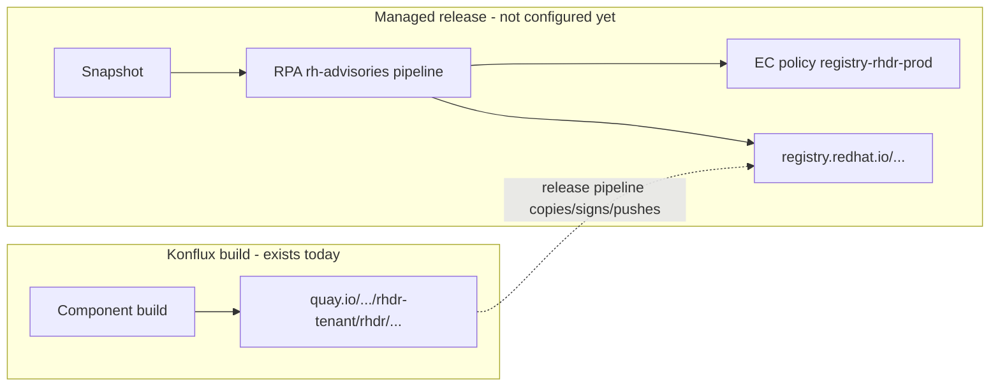
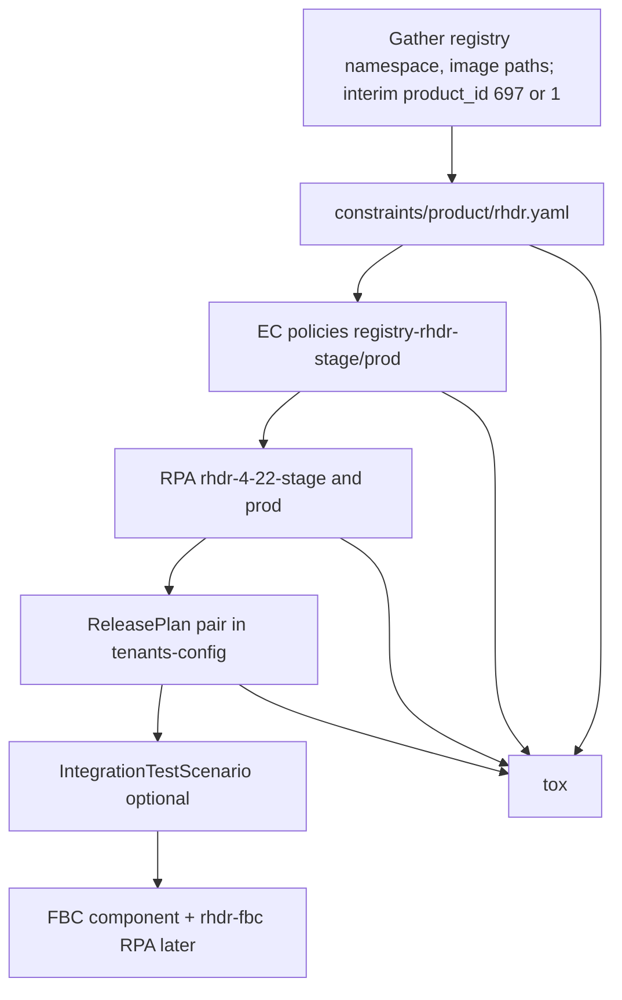

# RHDR Release Configuration: RPA, Constraints, and ReleasePlan

**Document version:** 1.2  
**Date:** 2026-06-04  
**Konflux tenant:** `rhdr-tenant` (cluster `stone-prod-p02`)  
**Application (4.22):** `rhdr-4-22`  
**Related JIRA:** [VIRTDR-141](https://redhat.atlassian.net/browse/VIRTDR-141)  
**Companion docs:** [ConstraintFileStages.md](./ConstraintFileStages.md), [CreateRHDRFBCApplication.md](./CreateRHDRFBCApplication.md), [RHDRCatalog.md](./RHDRCatalog.md)

---

## Terminology

| Term | Kubernetes kind | Where it lives | Role |
|------|-----------------|----------------|------|
| **RPA** | `ReleasePlanAdmission` | `konflux-release-data/config/.../ReleasePlanAdmission/` | Releng admission: defines *what* may be released, *which* policy applies, registry mapping, and release pipeline. Validated by constraints. |
| **ReleasePlan (RP)** | `ReleasePlan` | `konflux-release-data/tenants-config/.../rhdr-tenant/` | Tenant-side link from an `Application` to an RPA name via label `release.appstudio.openshift.io/releasePlanAdmission`. |
| **Constraints** | JSON Schema (not a CR) | `konflux-release-data/constraints/product/` | Limits RPAs for `origin: rhdr-tenant` (policies, registry URLs, pipelines). |
| **EC policy** | `EnterpriseContractPolicy` | `konflux-release-data/config/.../EnterpriseContractPolicy/` | Compliance rules referenced by `spec.policy` on the RPA. |

**RPA** always means **ReleasePlanAdmission**, not “release plan entry.”

---

## Clarifications (product_id, `registry-rhdr-*`, and Quay)

### 1. Where is `product_id` required, and can it change later?

`product_id` is the **engineering product identifier** from PMM / product database (same idea as rhodf `[547]` or rhwa `[697]`). It is **not** the Konflux tenant name and **not** a Quay organization name.

| Location | Required? | Purpose |
|----------|-----------|---------|
| **RPA** `spec.data.releaseNotes.product_id` | **Yes** for RHDR RPAs that use `pipelines/managed/rh-advisories/rh-advisories.yaml` | Advisory creation, release metadata, Pyxis/Atlas linkage in the release pipeline |
| **RPA** with `serviceAccountName: release-registry-prod` | **Yes** (enforced by repo tests) | `tests/sa_mappings.yaml` sets `require_product_id: true` for production registry releases |
| **RPA** stage (`release-registry-staging`) | **Strongly recommended / effectively required** if you use `rh-advisories` | `tests/test_tenant.py::test_release_notes_required_fields` requires `product_id`, `product_name`, and `product_version` for every RPA on that pipeline (stage and prod) |
| **FBC RPAs** (`fbc-release.yaml`) | **Yes** (same `releaseNotes` block) | Example: `rhodf-fbc-4-22-stage.yaml` includes `product_id: [547]` |
| **ReleasePlan** (`tenants-config`) | **No** — do not duplicate `product_id` on ReleasePlan | Release notes on ReleasePlan are for synopsis/description/solution only; forbidden keys include raw `issues`/`cves` |
| **Constraints** (`constraints/product/rhdr.yaml`) | **No** | Constraints validate shape of RPAs, not PMM IDs |
| **EnterpriseContractPolicy** (`registry-rhdr-*`) | **No** | EC policies define compliance rules, not product DB IDs |
| **`prodsec/` directory** | **Optional in git** for RHDR today | Some teams add prodsec YAML for cost-center / stream validation; `tox -e integration` can cross-check product definitions when configured. Not the same field as RPA `product_id`, but the ID should match PMM if both exist |

**Interim `product_id` for RHDR RPAs (until permanent eng-id):**

RHDR does not have a dedicated PMM engineering id yet. For **initial** `rhdr-4-22-stage.yaml` / `rhdr-4-22-prod.yaml` MRs, use **one** of these placeholders in `spec.data.releaseNotes.product_id` and add an inline comment:

| Interim value | When to use | Reference |
|---------------|-------------|-----------|
| `[697]` | **Preferred** for first MR — same eng-id as **rhwa-tenant** (RHWA) | All rhwa RPAs, e.g. `snr-0-13-stage.yaml` → `product_id: [697]` |
| `[1]` | Alternative generic placeholder if releng/PMM prefers a neutral stub | Must still satisfy non-zero id checks in `tests/test_sa_mappings.py` |

**Required comment in each RPA** (YAML `#` line immediately above or beside `product_id`):

```yaml
releaseNotes:
  product_name: "Red Hat Disaster Recovery"
  product_version: "4.22"
  # TODO(VIRTDR-141): interim eng-id — waiting for permanent RHDR product_id from PMM; replace [697] or [1] when assigned
  product_id: [697]
```

Use the **same** `product_id` in stage and prod RPAs on a given branch. When the permanent eng-id is issued, open a **follow-up MR** that only updates `product_id` (and removes the TODO comment).

**Typical RPA fragment (after permanent id is known):**

```yaml
data:
  releaseNotes:
    product_name: "Red Hat Disaster Recovery"
    product_version: "4.22"
    product_id: [<permanent integer from PMM>]
```

**Can `product_id` be changed in a future MR?**  
**Yes.** It is ordinary GitOps YAML in `konflux-release-data`. Teams update RPAs when PMM records change, products merge, or the wrong ID was used initially. Treat changes like any other RPA edit:

1. Open an MR changing `product_id` (and `product_name` / `product_version` if needed) in the affected RPA files.
2. Run `tox` (schema + `test_release_notes_required_fields` + SA mapping tests).
3. Merge; ArgoCD applies the updated RPA to the releng cluster.

**Caution:** Changing `product_id` after advisories or shipped releases exist can affect downstream systems (Pyxis, errata, prodsec streams). Coordinate with PMM/prodsec before changing a **production** ID, not because Konflux forbids the edit.

---

### 2. Where are `registry-rhdr-stage` / `registry-rhdr-prod` created or found?

These names are **`EnterpriseContractPolicy` resource names**, not container registry hostnames.

| Question | Answer |
|----------|--------|
| **Do they exist today?** | **No.** There are no `registry-rhdr-*.yaml` files on `main` in `konflux-release-data` yet (unlike `registry-rhodf-stage.yaml` / `registry-rhwa-stage.yaml`). |
| **Where to create them** | New files under:<br>`konflux-release-data/config/stone-prod-p02.hjvn.p1/product/EnterpriseContractPolicy/`<br>• `registry-rhdr-stage.yaml`<br>• `registry-rhdr-prod.yaml` |
| **What they are** | `kind: EnterpriseContractPolicy` with `metadata.name: registry-rhdr-stage` (or `-prod`) in namespace **`rhtap-releng-tenant`** |
| **Who references them** | RPAs set `spec.policy: registry-rhdr-stage` (or `-prod`). Constraints must allow those strings in `spec.policy.pattern`. Integration tests may reference `rhtap-releng-tenant/registry-rhdr-prod` in `IntegrationTestScenario`. |
| **How they are deployed** | Merged to `main` → ArgoCD applies to the Konflux releng workspace (same as rhodf/rhwa policies). |
| **How to author them** | Copy and adapt from existing neighbors in the same directory, e.g. `registry-rhodf-stage.yaml`, `registry-rhwa-stage.yaml` — adjust `allowed_registry_prefixes` for RHDR’s **Red Hat Container Registry** paths (`registry.stage.redhat.io/...`, `registry.redhat.io/...`). |

**Naming chain (do not confuse):**

```
EnterpriseContractPolicy.metadata.name     →  "registry-rhdr-prod"     (policy object name)
        ↑ referenced by
ReleasePlanAdmission.spec.policy           →  registry-rhdr-prod
        ↑ allowed by
constraints/product/rhdr.yaml              →  spec.policy.pattern includes registry-rhdr-prod
        ↑ separate from
RPA mapping repositories[].url             →  registry.redhat.io/<namespace>/<image>   (actual push destination)
```

Optional later: `fbc-rhdr-stage` / `fbc-rhdr-prod` (or shared `fbc-stage`) for FBC index releases — same directory, different `metadata.name` and FBC-specific rules.

---

### 3. Is [quay.io search for `rhdr-tenant`](https://quay.io/search?q=rhdr-tenant) the same as `registry-rhdr-*`?

**No.** They are different registries and different concepts.

| | **Konflux build registry (Quay)** | **Customer release registry + `registry-rhdr-*` policies** |
|---|-----------------------------------|-----------------------------------------------------------|
| **What it is** | Where Konflux **builds and stores** images during CI | Where **managed release** pushes **shipping** images after RPA/release pipeline |
| **Typical host** | `quay.io/redhat-services-prod/...` (Konflux shared org) | `registry.redhat.io` / `registry.stage.redhat.io` |
| **RHDR path today** | `ImageRepository.spec.image.name`: `rhdr-tenant/rhdr/<component>-4-22` → resolves under the Konflux Quay org, e.g. images discoverable via [Quay search for `rhdr-tenant`](https://quay.io/search?q=rhdr-tenant) | **Not configured yet** — RPA `mapping.components[].repositories[].url` will use `registry*.redhat.io/<product-namespace>/...` (namespace **TBD** from PMM/Container Catalog) |
| **Configured in** | `tenants-config/.../rhdr-4-22.yaml` (`ImageRepository` + builds) | Future RPAs + EC policies (`registry-rhdr-*`) |
| **Name similarity** | Org/repo path contains **`rhdr-tenant`** (Konflux namespace name) | Policy name contains **`rhdr`** (product shorthand) — coincidence of naming, not a link to Quay |

**Flow:**



- **Quay `rhdr-tenant` repos:** output of `docker-build-*` pipelines; SBOM webhooks to Bombino; used for development, EC integration tests, and as **source** for release.
- **`registry-rhdr-stage` / `registry-rhdr-prod`:** compliance policy names only; they do not appear in `quay.io` URLs.
- **Docs mentioning `quay.io/rh-ocp-dr/rhdr/`:** often a **team/product Quay** for standalone or pre-Konflux workflows — still **not** the same as `registry.redhat.io` shipping paths in the RPA.

Until RPAs exist, images remain on Konflux Quay only; they are **not** automatically published to `registry.redhat.io` under a product namespace.

---

## Executive summary

`rhdr-tenant` is onboarded for **builds** (namespace, RBAC, application, components, image repositories). It is **not** onboarded for **managed releases** to `registry.redhat.io` / `registry.stage.redhat.io`.

To release RHDR 4.22 (and later FBC), you need **three releng layers** plus **tenant ReleasePlans**, following the same pattern as `rhodf-tenant` and `rhwa-tenant`:

1. Constraints — `constraints/product/rhdr.yaml` (or `rhdr-tenant.yaml`; must match team convention)
2. Enterprise Contract policies — `registry-rhdr-stage`, `registry-rhdr-prod` (and later `fbc-rhdr-*` if using FBC index releases)
3. RPAs — stage + prod per release stream (e.g. `rhdr-4-22-stage.yaml`, `rhdr-4-22-prod.yaml`)
4. ReleasePlans in `tenants-config` — pair per application, pointing at those RPA names

Reference MRs in this repo (GitLab `!!` numbers from commit messages):

| MR (approx.) | What it did |
|--------------|-------------|
| [!!18262](https://gitlab.cee.redhat.com/releng/konflux-release-data/-/merge_requests/18262) | Created `rhdr-tenant` namespace, RBAC, CODEOWNERS (`tenants-config` only) |
| [!!18378](https://gitlab.cee.redhat.com/releng/konflux-release-data/-/merge_requests/18378) / [!!18635](https://gitlab.cee.redhat.com/releng/konflux-release-data/-/merge_requests/18635) | Added `rhdr-4-22` application and components |

For **ReleasePlan + RPA** patterns on similar products, use **rhodf** and **rhwa** trees (e.g. rhodf [!!13000](https://gitlab.cee.redhat.com/releng/konflux-release-data/-/merge_requests/13000) for 4.22 release config). The MR numbers you cited (567, 2017) are not present in local git history; treat rhodf/rhwa files on `main` as the source of truth.

---

## Part 1: Current `rhdr-tenant` content (what exists today)

### 1.1 Tenant infrastructure (`tenants-config`)

| Path | Contents |
|------|----------|
| `tenants-config/cluster/stone-prod-p02/admin/rhdr-tenant/` | Namespace `rhdr-tenant`, resource quota, limit range |
| `tenants-config/cluster/stone-prod-p02/tenants/rhdr-tenant/` | RBAC (admins, contributors, maintainers), kustomization |
| `tenants-config/cluster/stone-prod-p02/tenants/rhdr-tenant/rhdr-4-22.yaml` | Application + components + image repositories |
| `tenants-config/auto-generated/cluster/stone-prod-p02/.../rhdr-tenant/` | Generated manifests (must be committed after `build-manifests.sh`) |

**CODEOWNERS:** `@nlevanon @eduffy` for admin + tenant paths only. **No** CODEOWNERS for `config/.../ReleasePlanAdmission/rhdr/` or `constraints/product/rhdr*.yaml` yet.

### 1.2 Application and components (4.22)

**Application:** `rhdr-4-22` — display name “RHDR 4.22”.

| Component | Git source (branch `4.22`) | Image repository (Konflux/quay path) |
|-----------|----------------------------|--------------------------------------|
| `rhdr-cluster-operator-bundle-4-22` | `rh-ocp-dr/rhdr-cluster-operator-bundle` | `rhdr-tenant/rhdr/rhdr-cluster-operator-bundle-4-22` |
| `rhdr-csi-addons-operator-4-22` | `rh-ocp-dr/rhdr-csi-addons-operator` | `rhdr-tenant/rhdr/rhdr-csi-addons-operator-4-22` |
| `rhdr-csi-addons-operator-bundle-4-22` | `rh-ocp-dr/rhdr-csi-addons-operator-bundle` | `rhdr-tenant/rhdr/rhdr-csi-addons-operator-bundle-4-22` |
| `rhdr-csi-addons-sidecar-4-22` | `rh-ocp-dr/rhdr-csi-addons-sidecar` | `rhdr-tenant/rhdr/rhdr-csi-addons-sidecar-4-22` |
| `rhdr-hub-operator-bundle-4-22` | `rh-ocp-dr/rhdr-hub-operator-bundle` | `rhdr-tenant/rhdr/rhdr-hub-operator-bundle-4-22` |
| `rhdr-multicluster-operator-bundle-4-22` | `rh-ocp-dr/rhdr-multicluster-operator-bundle` | `rhdr-tenant/rhdr/rhdr-multicluster-operator-bundle-4-22` |
| `rhdr-multicluster-operator-image-4-22` | `rh-ocp-dr/rhdr-multicluster-operator-image` | `rhdr-tenant/rhdr/rhdr-multicluster-operator-image-4-22` |
| `rhdr-ramen-operator-base-image-4-22` | `rh-ocp-dr/rhdr-ramen-operator` | `rhdr-tenant/rhdr/rhdr-ramen-operator-base-image-4-22` |
| `rhdr-ramendr-console-4-22` | `rh-ocp-dr/rhdr-multicluster-console` | `rhdr-tenant/rhdr/rhdr-ramendr-console-4-22` |

**Not present yet in tenant config:**

- `rhdr-fbc-catalog-4-22` (FBC catalog component — see [CreateRHDRFBCApplication.md](./CreateRHDRFBCApplication.md))
- Hub/cluster **operator** images (only bundles + MCO image + ramen base + console today)
- `IntegrationTestScenario` (enterprise-contract) — rhodf 4.22 uses `rhodf-4-22-enterprise-contract`
- Any `ReleasePlan` resources

Build pipeline annotation on components: `docker-build-multi-platform-oci-ta`.

### 1.3 Managed release config (`config/`, `constraints/`, `prodsec/`)

| Area | Status for RHDR |
|------|-----------------|
| `constraints/product/rhdr*.yaml` | **Missing** |
| `config/stone-prod-p02.hjvn.p1/product/EnterpriseContractPolicy/registry-rhdr-*` | **Missing** |
| `config/stone-prod-p02.hjvn.p1/product/ReleasePlanAdmission/rhdr/` | **Missing** (no directory) |
| `prodsec/` entry for RHDR product | **Not found** in repo |

---

## Part 2: What is left — tenant setup (constraints and policies)

### 2.1 Constraints file (required before any RPA merges)

**Create:** `constraints/product/rhdr.yaml` (rhodf uses `rhodf.yaml`, not `rhodf-tenant.yaml` — align with releng naming when opening the MR).

**Purpose:** JSON Schema validation so only approved RPAs from `origin: rhdr-tenant` can be admitted.

**Model after:** `constraints/product/rhodf.yaml` and `constraints/product/rhwa.yaml`.

**Minimum fields to define (with product team — do not guess):**

| Field | rhodf example | rhwa example | RHDR action |
|-------|---------------|--------------|-------------|
| `spec.origin.pattern` | `rhodf-tenant` | `rhwa-tenant` | `rhdr-tenant` |
| `spec.policy.pattern` | `registry|fbc` + rhodf stage/prod | `registry-rhwa-stage`, `fbc-rhwa-prod`, etc. | Allow `registry-rhdr-stage`, `registry-rhdr-prod`, and FBC names if needed |
| `spec.data.mapping.components[].repositories[].url.pattern` | `registry.*.io/odf4/*` | `registry.*.io/workload-availability/*` | **TBD:** e.g. `registry\.(redhat|stage\.redhat)\.io/<namespace>/...` |
| `pushSourceContainer` | required `true` + defaults | same | match rhodf/rhwa for operator releases |
| `spec.pipeline` | git resolver, catalog URL, path, SA | similar | `rh-advisories.yaml` for containers; `fbc-release.yaml` for FBC |

**Open product inputs (blockers):**

1. **Red Hat registry namespace** for shipped images (placeholder in older docs: `rh-disaster-recovery` / `odf4`-style path). Must match Container Catalog / PMM, not only `quay.io/rh-ocp-dr/rhdr/`.
2. **Allowed policy names** once EC policy files are named.
3. **FBC constraints** (if releasing catalog to operator index): copy `fbc` section from `rhodf.yaml` (fromIndex, targetIndex, publishingCredentials, etc.).

**CODEOWNERS:** add sorted entries for `constraints/product/rhdr.yaml` (run `tox -e codeowners-lint-fix`).

### 2.2 Enterprise Contract policies (required for RPA `spec.policy`)

See also [Clarifications §2](#2-where-are-registry-rhdr-stage--registry-rhdr-prod-created-or-found) (these files **do not exist yet**; you create them) and [§3](#3-is-quayio-search-for-rhdr-tenant-the-same-as-registry-rhdr-) (Quay vs Red Hat registry).

**Create (typical pair):**

| File | Referenced by |
|------|----------------|
| `config/stone-prod-p02.hjvn.p1/product/EnterpriseContractPolicy/registry-rhdr-stage.yaml` | `rhdr-*-stage` RPAs |
| `config/stone-prod-p02.hjvn.p1/product/EnterpriseContractPolicy/registry-rhdr-prod.yaml` | `rhdr-*-prod` RPAs |

**Model after:**

- `registry-rhodf-stage.yaml` / `registry-rhodf-prod.yaml`
- `registry-rhwa-stage.yaml` / `registry-rhwa-prod.yaml`

**Differences to implement:**

- `allowed_registry_prefixes`: stage → `registry.stage.redhat.io/`; prod → `registry.redhat.io/`
- Stage often excludes `cve.cve_blockers`; prod enforces CVE rules (see rhodf stage vs prod)
- Annotation `konflux-release-data/derived-from: registry-standard` or `registry-standard-stage`

**Optional later (FBC):**

- `fbc-rhdr-stage.yaml` / `fbc-rhdr-prod.yaml` — mirror `fbc-rhodf-prod.yaml` and rhwa `fbc-rhwa-*` if RHDR catalog is published via IIB/redhat-operator-index.

**CODEOWNERS:** add paths under `config/stone-prod-p02.hjvn.p1/product/EnterpriseContractPolicy/` for new policy files.

### 2.3 Prodsec and `product_id` (see [Clarifications §1](#1-where-is-product_id-required-and-can-it-change-later))

rhodf RPAs use `product_id: [547]`; rhwa uses `[697]`. RHDR RPAs may ship with **interim** `[697]` or `[1]` plus a TODO comment until PMM assigns the permanent eng-id (see [interim `product_id`](#interim-product_id-for-rhdr-rpas-until-permanent-eng-id)). Optional `prodsec/` YAML may be added later — coordinate with prodsec if `tox -e integration` is required in CI.

---

## Part 3: What is left — RPA for stage and production

### 3.1 ReleasePlanAdmission files (releng)

**Create directory:** `config/stone-prod-p02.hjvn.p1/product/ReleasePlanAdmission/rhdr/`

**Minimum for RHDR 4.22 operator/container release (mirror rhodf):**

| File | `metadata.name` | `spec.policy` | `data.intention` | Registry URLs in mapping |
|------|-----------------|---------------|------------------|---------------------------|
| `rhdr-4-22-stage.yaml` | `rhdr-4-22-stage` | `registry-rhdr-stage` | `staging` | `registry.stage.redhat.io/...` |
| `rhdr-4-22-prod.yaml` | `rhdr-4-22-prod` | `registry-rhdr-prod` | `production` | `registry.redhat.io/...` |

**Shared RPA skeleton (from rhodf-4-22-stage / rhwa snr-0-13-stage):**

```yaml
spec:
  applications:
    - rhdr-4-22
  origin: rhdr-tenant
  policy: registry-rhdr-stage   # or registry-rhdr-prod on prod file
  data:
    releaseNotes:
      product_name: "Red Hat Disaster Recovery"
      product_version: "4.22"
      # TODO(VIRTDR-141): interim eng-id — waiting for permanent RHDR product_id from PMM; replace when assigned
      product_id: [697]   # interim: rhwa-tenant eng-id; alternative interim: [1]
    mapping:
      registrySecret: konflux-release-service-access-management-token
      defaults:
        public: false
        pushSourceContainer: true
        tags:            # copy pattern from rhodf or rhwa
          - "v4.22"
          - "v4.22-{{ timestamp }}"
          - "{{ labels.version }}"
          - "{{ labels.version }}-{{ labels.release }}"
      components:
        - name: <component-name-must-match-tenant>
          repositories:
            - url: "registry.stage.redhat.io/<namespace>/<image>"
  pipeline:
    pipelineRef:
      resolver: git
      params:
        - name: url
          value: "https://github.com/konflux-ci/release-service-catalog.git"
        - name: revision
          value: production    # rhwa stage sometimes uses development — confirm with releng
        - name: pathInRepo
          value: "pipelines/managed/rh-advisories/rh-advisories.yaml"
    serviceAccountName: release-registry-staging   # prod: release-registry-prod
```

**Component mapping checklist** — each row must match a **Konflux component name** in `rhdr-4-22.yaml` and a **real** `registry.*.io` repository URL:

| Tenant component | Likely release artifact | In RPA stage/prod? |
|------------------|-------------------------|-------------------|
| `rhdr-hub-operator-bundle-4-22` | Operator bundle | Required |
| `rhdr-cluster-operator-bundle-4-22` | Operator bundle | Required |
| `rhdr-multicluster-operator-bundle-4-22` | Operator bundle | Required |
| `rhdr-csi-addons-operator-bundle-4-22` | Operator bundle | Required |
| `rhdr-csi-addons-operator-4-22` | Operator image | Required |
| `rhdr-csi-addons-sidecar-4-22` | Sidecar image | Required |
| `rhdr-multicluster-operator-image-4-22` | Operator image | Required |
| `rhdr-ramen-operator-base-image-4-22` | Base image | Required if shipped |
| `rhdr-ramendr-console-4-22` | Console | Required if shipped |

**Optional separate RPAs (rhodf pattern):**

| File | When |
|------|------|
| `rhdr-fbc-4-22-stage.yaml` / `rhdr-fbc-4-22-prod.yaml` | After `rhdr-fbc-catalog-4-22` exists; policy `fbc-rhdr-*` or shared `fbc-stage`; pipeline `fbc-release.yaml`; SA `release-index-image-staging` / `release-index-image-prod` |
| Per-operator RPAs | Only if RHDR splits applications like rhwa (`snr-0-13` separate app) — **not** required if everything stays on `rhdr-4-22` |

**Metadata labels** (copy from rhodf/rhwa):

- `release.appstudio.openshift.io/block-releases: "false"`
- `pp.engineering.redhat.com/business-unit: other`
- Optional: `operator_name`, `rhel_target: el9`

**CODEOWNERS:** add `/config/stone-prod-p02.hjvn.p1/product/ReleasePlanAdmission/rhdr/ @...`

### 3.2 ReleasePlan resources (tenant — links app → RPA)

RPAs alone do not trigger tenant releases until **ReleasePlan** objects exist in `rhdr-tenant`.

**Model after rhodf 4.22:** `tenants-config/.../rhodf-tenant/rhodf/overlay/rhodf/4.22/release-plans.yaml`

**Create for RHDR** (location options):

- Add `tenants-config/cluster/stone-prod-p02/tenants/rhdr-tenant/rhdr-4-22-release-plans.yaml`, or
- Follow rhodf overlay layout if you expect many versions

**Two ReleasePlan objects per application version:**

| ReleasePlan `metadata.name` | Label `releasePlanAdmission` | `spec.application` | Typical `auto-release` |
|----------------------------|------------------------------|--------------------|-------------------------|
| `rhdr-4-22-stage-releaseplan` | `rhdr-4-22-stage` | `rhdr-4-22` | `false` (rhodf) or `true` (some rhwa stage) |
| `rhdr-4-22-prod-releaseplan` | `rhdr-4-22-prod` | `rhdr-4-22` | `false` |

Example (rhodf-style):

```yaml
apiVersion: appstudio.redhat.com/v1alpha1
kind: ReleasePlan
metadata:
  labels:
    release.appstudio.openshift.io/auto-release: 'false'
    release.appstudio.openshift.io/standing-attribution: 'true'
    release.appstudio.openshift.io/releasePlanAdmission: "rhdr-4-22-prod"
  name: rhdr-4-22-prod-releaseplan
spec:
  application: rhdr-4-22
  target: rhtap-releng-tenant
  data:
    releaseNotes:
      solution: |
        <TBD — product documentation URL>
```

Update `tenants-config/.../rhdr-tenant/kustomization.yaml`, run `./build-single.sh rhdr-tenant` or `./build-manifests.sh`, commit `auto-generated/`.

### 3.3 Integration test (recommended before first release)

rhodf wires Enterprise Contract at application level. RHDR should add:

- `IntegrationTestScenario` referencing `rhtap-releng-tenant/registry-rhdr-stage` (or prod policy name used in CI)
- Patch in kustomize if following rhodf overlay pattern

Without this, snapshots may not run EC gates before release.

---

## Part 4: Reference comparison (rhodf vs rhwa vs rhdr)

| Item | rhodf-tenant | rhwa-tenant | rhdr-tenant (today) |
|------|--------------|-------------|---------------------|
| Constraints | `constraints/product/rhodf.yaml` | `constraints/product/rhwa.yaml` | **None** |
| EC policies | `registry-rhodf-*`, `fbc-rhodf-prod` | `registry-rhwa-*`, `fbc-rhwa-*` | **None** |
| RPA directory | `ReleasePlanAdmission/rhodf/` | `ReleasePlanAdmission/rhwa/` | **None** |
| 4.22 container RPA | `rhodf-4-22-stage/prod` | per-operator (e.g. `snr-0-13-stage`) | **None** |
| FBC RPA | `rhodf-fbc-4-22-stage/prod` | `rhwa-fbc-stage/prod` | **None** |
| ReleasePlan in tenants-config | `release-plans.yaml` per version | `*-releaseplans.yaml` per app | **None** |
| Registry namespace | `odf4/` | `workload-availability/` | **TBD** (builds use Konflux quay paths) |
| `product_id` in RPA | `[547]` | `[697]` (RHWA) | **Interim `[697]` or `[1]`** + TODO; permanent eng-id pending PMM |

---

## Part 5: Implementation order and validation

Recommended merge order (dependencies):



**Validation commands:**

```bash
cd /path/to/konflux-release-data
tox -e test          # schema + constraints vs RPAs
tox -e yamllint
cd tenants-config && ./build-single.sh rhdr-tenant && cd .. && tox -e tenants-config-test
tox -e codeowners-lint
```

**Do not merge RPAs** until constraints and EC policies with matching `policy` names exist on the same branch.

---

## Part 6: Information required from product / PMM (do not guess)

Collect before filing the konflux-release-data MR:

| # | Question | Used in |
|---|----------|---------|
| 1 | Official **product name** (use RHDR name now); **product_id** — interim `[697]` or `[1]` with TODO until permanent eng-id from PMM | RPA `releaseNotes`, prodsec |
| 2 | **registry.redhat.io** namespace and image names per component | Constraints URL pattern, RPA `mapping` |
| 3 | Confirm **4.22** is the only stream initially | File names `rhdr-4-22-*` |
| 4 | Will RHDR ship **FBC** to redhat-operator-index? If yes, OCP versions (4.14–4.23?) | FBC RPA + constraints `fbc` block |
| 5 | **Release notes** / documentation URL for ReleasePlan `solution` | ReleasePlan `spec.data` |
| 6 | Stage **auto-release** yes/no | ReleasePlan labels |
| 7 | Hub/cluster operator images — separate components or bundle-only release? | RPA component list |

---

## Part 7: MR checklist (konflux-release-data)

### Phase A — Enable releases for 4.22 containers

- [ ] `constraints/product/rhdr.yaml`
- [ ] `registry-rhdr-stage.yaml`, `registry-rhdr-prod.yaml`
- [ ] `ReleasePlanAdmission/rhdr/rhdr-4-22-stage.yaml` — `product_id: [697]` or `[1]` + TODO comment re permanent eng-id
- [ ] `ReleasePlanAdmission/rhdr/rhdr-4-22-prod.yaml` — same `product_id` as stage
- [ ] `tenants-config/.../rhdr-tenant/` — ReleasePlan YAML + kustomization
- [ ] CODEOWNERS for constraints, config/rhdr, EC policies
- [ ] `build-manifests.sh` / `build-single.sh` + commit `auto-generated/`
- [ ] `tox` green

### Phase B — FBC (after catalog component exists)

- [ ] Add `rhdr-fbc-catalog-4-22` to `rhdr-4-22.yaml`
- [ ] FBC EC policies (if not covered by shared `fbc-stage`)
- [ ] `rhdr-fbc-4-22-stage.yaml`, `rhdr-fbc-4-22-prod.yaml`
- [ ] ReleasePlans for FBC application (if separate app like `rhodf-fbc-4-22`)

---

## Part 8: Quick file paths

| Purpose | Path |
|---------|------|
| RHDR tenant source | `tenants-config/cluster/stone-prod-p02/tenants/rhdr-tenant/` |
| RHDR RPAs (to create) | `config/stone-prod-p02.hjvn.p1/product/ReleasePlanAdmission/rhdr/` |
| RHDR constraints (to create) | `constraints/product/rhdr.yaml` |
| RHDR EC policies (to create) | `config/stone-prod-p02.hjvn.p1/product/EnterpriseContractPolicy/registry-rhdr-*.yaml` |
| rhodf reference RPA | `config/.../ReleasePlanAdmission/rhodf/rhodf-4-22-stage.yaml` |
| rhwa reference RPA | `config/.../ReleasePlanAdmission/rhwa/snr-0-13-stage.yaml` |
| rhodf reference ReleasePlan | `tenants-config/.../rhodf-tenant/rhodf/overlay/rhodf/4.22/release-plans.yaml` |

---

**Status:** Draft v1.2 — registry namespace remains a blocker; `product_id` may use interim `[697]` (rhwa) or `[1]` with TODO until PMM assigns permanent eng-id; `registry-rhdr-*` policies must be created in `EnterpriseContractPolicy/`.  
**Next step:** Confirm PMM/registry paths, then open konflux-release-data MR (constraints + EC policies + RPAs with interim `product_id` + ReleasePlans). Follow-up MR when permanent eng-id is known.
