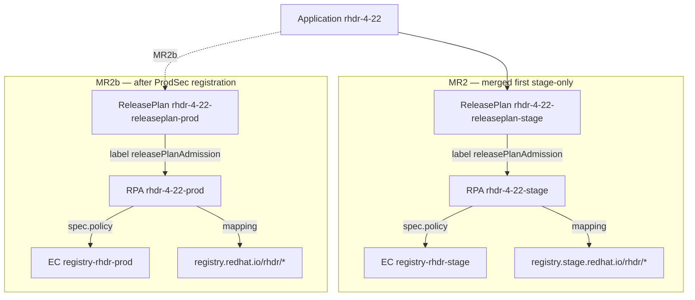
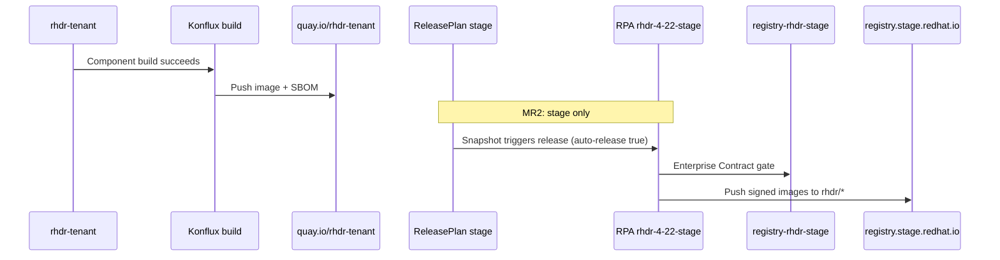

# RHDR ReleasePlan and ReleasePlanAdmission — Implementation Guide

**Document version:** 1.0  
**Date:** 2026-06-16  
**Konflux tenant:** `rhdr-tenant` (cluster `stone-prod-p02` / `stone-prod-p02.hjvn.p1`)  
**Application:** `rhdr-4-22`  
**Related JIRA:** [VIRTDR-141](https://redhat.atlassian.net/browse/VIRTDR-141)  
**Companion docs:** [RHDRReleasePlanAdmissionRequirements.md](./RHDRReleasePlanAdmissionRequirements.md), [ConstraintFileStages.md](./ConstraintFileStages.md), [CreateContainerRepositories.md](./CreateContainerRepositories.md)

**GitLab MRs (konflux-release-data):**

| MR | Branch | Link / status |
|----|--------|----------------|
| MR1 — constraints | merged | [!18701](https://gitlab.cee.redhat.com/releng/konflux-release-data/-/merge_requests/18701) |
| MR2 — stage release config | open | [!19133](https://gitlab.cee.redhat.com/releng/konflux-release-data/-/merge_requests/19133) (`rhdr-release-plan2`) |
| MR2b — prod RPA + prod RP | planned | After ProdSec stream registration |
| MR3 — FBC RP/RPA | planned | See [CreateRHDRFBCApplication.md](./CreateRHDRFBCApplication.md) |

---

## Terminology

| Shorthand | Kubernetes kind | Repo path | Role |
|-----------|-----------------|-----------|------|
| **RP** | `ReleasePlan` | `tenants-config/.../rhdr-tenant/` | Tenant link: `Application` → RPA name (`releasePlanAdmission` label) |
| **RPA** | `ReleasePlanAdmission` | `config/.../ReleasePlanAdmission/rhdr/` | Releng admission: policy, Pyxis mapping, pipeline, advisory metadata |
| **EC** | `EnterpriseContractPolicy` | `config/.../EnterpriseContractPolicy/registry-rhdr-*.yaml` | Compliance policy referenced by `spec.policy` on the RPA |
| **Constraints** | JSON Schema | `constraints/product/rhdr.yaml` | Validates RPAs from `origin: rhdr-tenant` |
| **ProdSec template** | YAML (not a CR) | `prodsec/rhdr.yaml` | Stream + CPE templates for advisory/CVE metadata |

> **Note:** Some docs use “RPE” informally for the releng release admission entry — in Konflux that is always **`ReleasePlanAdmission` (RPA)**, not a separate CR.

---

## Staging vs production separation (MR2 / MR2b)

RHDR follows the **rhodf / rhwa pattern**: **separate stage and prod pairs** for RPA, ReleasePlan, and (when referenced) EC policy. They are **not** a single combined resource.



| Layer | Staging (MR2) | Production (MR2b) |
|-------|-----------------|-------------------|
| **RPA** | `rhdr-4-22-stage` | `rhdr-4-22-prod` |
| **RP** | `rhdr-4-22-releaseplan-stage` | `rhdr-4-22-releaseplan-prod` |
| **EC policy** | `registry-rhdr-stage` | `registry-rhdr-prod` |
| **Registry** | `registry.stage.redhat.io/rhdr/...` | `registry.redhat.io/rhdr/...` |
| **`data.intention`** | `staging` | `production` |
| **Pipeline SA** | `release-registry-staging` | `release-registry-prod` |
| **auto-release** (RP label) | `true` (rhwa-style) | `false` (rhwa-style) |
| **ProdSec stream test** (`integration`) | Skipped for stage | Runs on prod RPA only |
| **`prodsec/rhdr.yaml`** | Required in MR2 (stage RPA uses `rh-advisories`) | Same file; stream must exist in product-definitions before prod RPA merges |

### Why MR2 was split

The first MR2 attempt included **stage + prod RPA**. CI **`integration`** failed because ProdSec has not registered stream `red-hat-disaster-recovery-4.22` in [product-definitions](https://gitlab.cee.redhat.com/prodsec/product-definitions/).

**MR2 (current):** stage RPA + stage ReleasePlan + `prodsec/rhdr.yaml` (template only).  
**MR2b (follow-up):** prod RPA + prod ReleasePlan + `registry-rhdr-prod.yaml` (if not already merged).

> **CI note:** Every `EnterpriseContractPolicy` must be referenced by at least one RPA (`test_valid_contract_admissions_references`). If MR2 is stage-only, **do not** merge `registry-rhdr-prod.yaml` until MR2b adds `rhdr-4-22-prod.yaml`.

---

## Product identifiers

| Field | Value | Where |
|-------|-------|--------|
| **product_name** | `Red Hat Disaster Recovery` | RPA `spec.data.releaseNotes` |
| **product_version** | `4.22` | RPA `spec.data.releaseNotes` |
| **product_id** | `[1119]` | RPA `spec.data.releaseNotes` (RELENG-351) |
| **Pyxis team_id** | `6a2ac4cfac275e819eca5d8f` | pyxis-repo-configs (not in RPA) |
| **Registry namespace** | `rhdr/` | Constraints + RPA `mapping` URLs |
| **ProdSec stream** (proposed) | `red-hat-disaster-recovery-4.22` | `prodsec/rhdr.yaml` → product-definitions |
| **ProdSec CPE** (proposed) | `cpe:/a:redhat:red_hat_disaster_recovery:4.22::el9` | `prodsec/rhdr.yaml` |

---

## File inventory

### MR1 (merged)

| File | Purpose |
|------|---------|
| `constraints/product/rhdr.yaml` | Self-service limits for `rhdr-tenant` RPAs |
| CODEOWNERS | `@releng/rhtap-releng` for constraints only |

### MR2 (stage — [!19133](https://gitlab.cee.redhat.com/releng/konflux-release-data/-/merge_requests/19133))

| File | Purpose |
|------|---------|
| `config/.../EnterpriseContractPolicy/registry-rhdr-stage.yaml` | Stage EC policy |
| `config/.../ReleasePlanAdmission/rhdr/rhdr-4-22-stage.yaml` | Stage RPA |
| `prodsec/rhdr.yaml` | Stream/CPE template (required for stage `rh-advisories` tests) |
| `tenants-config/.../rhdr-4-22-release-plans.yaml` | Stage ReleasePlan only |
| `tenants-config/.../kustomization.yaml` | Includes release-plans file |
| `tenants-config/auto-generated/.../releaseplan-stage.yaml` | Generated from kustomize |
| CODEOWNERS | `@nlevanon @eduffy` for EC + RPA paths |

### MR2b (prod — planned)

| File | Purpose |
|------|---------|
| `config/.../EnterpriseContractPolicy/registry-rhdr-prod.yaml` | Prod EC policy (if removed from MR2) |
| `config/.../ReleasePlanAdmission/rhdr/rhdr-4-22-prod.yaml` | Prod RPA |
| `tenants-config/.../rhdr-4-22-release-plans.yaml` | Add prod ReleasePlan document |
| `tenants-config/auto-generated/.../releaseplan-prod.yaml` | Regenerate via `build-single.sh` |

---

## Enterprise Contract policies

Both policies extend `registry-standard` (rhodf pattern). Stage excludes `cve.cve_blockers` and `schedule.weekday_restriction`; prod excludes `cve.cve_blockers` only.

| Policy | `metadata.name` | `allowed_registry_prefixes` | Referenced by |
|--------|-----------------|----------------------------|---------------|
| Stage | `registry-rhdr-stage` | `registry.redhat.io/`, `registry.access.redhat.com/`, `brew.registry.redhat.io/` | `rhdr-4-22-stage` RPA |
| Prod | `registry-rhdr-prod` | same | `rhdr-4-22-prod` RPA (MR2b) |

**Paths:**

- `config/stone-prod-p02.hjvn.p1/product/EnterpriseContractPolicy/registry-rhdr-stage.yaml`
- `config/stone-prod-p02.hjvn.p1/product/EnterpriseContractPolicy/registry-rhdr-prod.yaml`

---

## ReleasePlanAdmission (RPA)

### Shared settings (stage and prod)

| Field | Value |
|-------|-------|
| `spec.applications` | `[rhdr-4-22]` |
| `spec.origin` | `rhdr-tenant` |
| Pipeline | `pipelines/managed/rh-advisories/rh-advisories.yaml` |
| Pipeline revision | `production` |
| `registrySecret` | `konflux-release-service-access-management-token` |
| `defaults.pushSourceContainer` | `true` |
| `defaults.public` | `false` |
| Tags | `v4.22`, `v4.22-{{ timestamp }}`, `{{ labels.version }}`, `{{ labels.version }}-{{ labels.release }}` |

### Stage RPA (`rhdr-4-22-stage`) — in MR2

| Field | Value |
|-------|-------|
| `spec.policy` | `registry-rhdr-stage` |
| `data.intention` | `staging` |
| `serviceAccountName` | `release-registry-staging` |
| Registry host in mapping | `registry.stage.redhat.io/rhdr/...` |

### Prod RPA (`rhdr-4-22-prod`) — MR2b template

| Field | Value |
|-------|-------|
| `spec.policy` | `registry-rhdr-prod` |
| `data.intention` | `production` |
| `serviceAccountName` | `release-registry-prod` |
| Registry host in mapping | `registry.redhat.io/rhdr/...` |

Use the same six component mappings as stage; only registry host and policy/intention/SA differ (mirror `rhodf-4-22-stage` vs `rhodf-4-22-prod`).

---

## Component mapping (Konflux name → Pyxis path)

Operator controller images **must** include `-rhel9-` in the Pyxis repo path (Cicada rule). Bundle names omit `-rhel9-`.

| Konflux component | Pyxis repo (stage / prod) | MR |
|-------------------|---------------------------|-----|
| `rhdr-hub-operator-bundle-4-22` | `rhdr/rhdr-hub-operator-bundle` | MR2 |
| `rhdr-cluster-operator-bundle-4-22` | `rhdr/rhdr-cluster-operator-bundle` | MR2 |
| `rhdr-multicluster-operator-bundle-4-22` | `rhdr/rhdr-multicluster-operator-bundle` | MR2 |
| `rhdr-multicluster-operator-image-4-22` | `rhdr/rhdr-multicluster-rhel9-operator` | MR2 |
| `rhdr-csi-addons-operator-4-22` | `rhdr/rhdr-csi-addons-rhel9-operator` | MR2 |
| `rhdr-csi-addons-operator-bundle-4-22` | `rhdr/rhdr-csi-addons-operator-bundle` | MR2 |
| `rhdr-hub-operator-*` (controller) | `rhdr/rhdr-hub-rhel9-operator` | MR2b — no Konflux Component yet |
| `rhdr-cluster-operator-*` (controller) | `rhdr/rhdr-cluster-rhel9-operator` | MR2b — no Konflux Component yet |
| `rhdr-csi-addons-sidecar-4-22` | TBD Pyxis MR2 | Deferred |
| `rhdr-ramen-operator-base-image-4-22` | TBD | Deferred |
| `rhdr-ramendr-console-4-22` | TBD | Deferred |

---

## ReleasePlan (RP)

### Stage (MR2)

```yaml
metadata:
  name: rhdr-4-22-releaseplan-stage
  namespace: rhdr-tenant
  labels:
    release.appstudio.openshift.io/auto-release: "true"
    release.appstudio.openshift.io/releasePlanAdmission: "rhdr-4-22-stage"
    release.appstudio.openshift.io/standing-attribution: "true"
spec:
  application: rhdr-4-22
  target: rhtap-releng-tenant
  releaseGracePeriodDays: 30
```

### Prod (MR2b)

```yaml
metadata:
  name: rhdr-4-22-releaseplan-prod
  namespace: rhdr-tenant
  labels:
    release.appstudio.openshift.io/auto-release: "false"
    release.appstudio.openshift.io/releasePlanAdmission: "rhdr-4-22-prod"
    release.appstudio.openshift.io/standing-attribution: "true"
spec:
  application: rhdr-4-22
  target: rhtap-releng-tenant
  releaseGracePeriodDays: 30
```

**Source:** `tenants-config/cluster/stone-prod-p02/tenants/rhdr-tenant/rhdr-4-22-release-plans.yaml`  
After edits: `./build-single.sh rhdr-tenant` and commit `auto-generated/`.

---

## ProdSec template (`prodsec/rhdr.yaml`)

```yaml
stream: red-hat-disaster-recovery-{.spec.data.releaseNotes.product_version | split(".") | .[0] + "." + .[1]}
cpe: cpe:/a:redhat:red_hat_disaster_recovery:{.spec.data.releaseNotes.product_version | split(".") | .[0] + "." + .[1]}::el9
```

| CI job | Behavior |
|--------|----------|
| `tox -e test` | Requires file for any `rh-advisories` RPA (including **stage**) |
| `tox -e integration` | Validates rendered stream exists in product-definitions for **prod** RPAs only |

**Action item before MR2b:** Register stream + CPE in #wg-cpe-assignments (see [Requirements §2.3](./RHDRReleasePlanAdmissionRequirements.md#23-prodsec-stream-registration-required-for-prod-rpa)).

---

## Constraints summary (`constraints/product/rhdr.yaml`)

| Rule | Pattern |
|------|---------|
| `spec.origin` | `rhdr-tenant` |
| `spec.policy` | `registry-rhdr-stage`, `registry-rhdr-prod`, `fbc-rhdr-*`, etc. |
| Repository URLs | `registry.(redhat\|stage.redhat).io/rhdr/*` |
| `pushSourceContainer` | required `true` |
| Pipelines | `rh-advisories.yaml`, `fbc-release.yaml`, … |

---

## Release flow (end-to-end)



Production flow is identical after MR2b, using prod RP/RPA/EC and `registry.redhat.io`.

---

## How to add a component to an existing RPA

1. **Konflux:** Add `Component` + `ImageRepository` in `rhdr-4-22.yaml`; run `build-single.sh rhdr-tenant`.
2. **Pyxis:** Ensure repo exists under `rhdr/` in [pyxis-repo-configs](https://gitlab.cee.redhat.com/releng/pyxis-repo-configs) (staging + prod).
3. **RPA:** Add row to `mapping.components[]` in **both** stage and prod YAML (when prod exists):
   - `name` = exact Konflux component name
   - `repositories[].url` = `registry[.stage].redhat.io/rhdr/<pyxis-repo-name>`
4. **Constraints:** URL must match `registry\.(redhat|stage\.redhat)\.io/rhdr/*` (already in `rhdr.yaml`).
5. **Validate:** `tox -e test` with MR env vars; re-run `integration` after prod mapping changes.

---

## Validation checklist

```bash
cd konflux-release-data
git fetch origin main
export CI_MERGE_REQUEST_TARGET_BRANCH_NAME=main
export CI_COMMIT_SHA=$(git rev-parse HEAD)

tox -e test -e codeowners-lint
tox -e tenants-config-test    # repo must be clean (no stray untracked files)
tox -e integration            # VPN; prod RPA only in MR2b
```

| MR | Expected CI |
|----|----------------|
| MR2 (stage only) | `test`, `codeowners-lint`, `tenants-config-test`, `integration` pass |
| MR2b (+ prod RPA) | All above + `integration` stream lookup for `red-hat-disaster-recovery-4.22` |

---

## MR3 — FBC (pointer only)

FBC uses a **separate** stage/prod RPA pair (`rhdr-fbc-4-22-*`), FBC EC policies, and inverted auto-release (stage `false`, prod `true` per rhodf FBC pattern). See [CreateRHDRFBCApplication.md](./CreateRHDRFBCApplication.md) and [RHDRCatalog.md](./RHDRCatalog.md).

---

## CODEOWNERS

| Path | Owners |
|------|--------|
| `constraints/product/rhdr.yaml` | `@releng/rhtap-releng` |
| `config/.../ReleasePlanAdmission/rhdr/` | `@nlevanon @eduffy` |
| `config/.../EnterpriseContractPolicy/registry-rhdr-*.yaml` | `@nlevanon @eduffy` |
| `prodsec/rhdr.yaml` | `@jperezde @teagle` (via `/prodsec/`) |
| `tenants-config/.../rhdr-tenant/` | `@nlevanon @eduffy` |

---

## Quick reference paths

| Item | Path |
|------|------|
| Stage RPA | `config/stone-prod-p02.hjvn.p1/product/ReleasePlanAdmission/rhdr/rhdr-4-22-stage.yaml` |
| Prod RPA (MR2b) | `config/stone-prod-p02.hjvn.p1/product/ReleasePlanAdmission/rhdr/rhdr-4-22-prod.yaml` |
| ReleasePlans source | `tenants-config/cluster/stone-prod-p02/tenants/rhdr-tenant/rhdr-4-22-release-plans.yaml` |
| rhodf reference | `config/.../ReleasePlanAdmission/rhodf/rhodf-4-22-stage.yaml` |
| rhwa auto-release reference | `tenants-config/.../rhwa-tenant/*-releaseplans.yaml` |

---

**Status:** MR2 stage RP + RPA + EC stage + prodsec template implemented on `rhdr-release-plan2`. Production RP/RPA/EC prod deferred to **MR2b** pending ProdSec stream registration.
