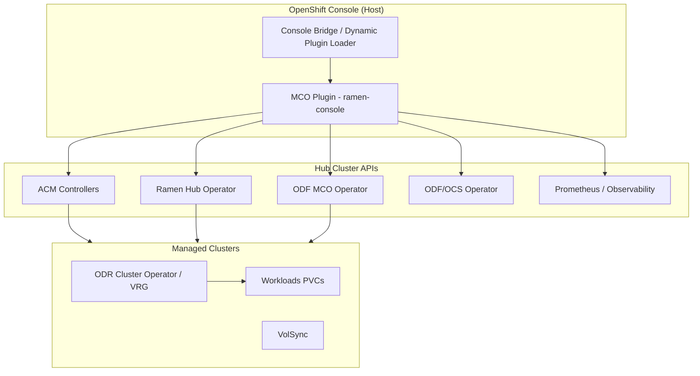
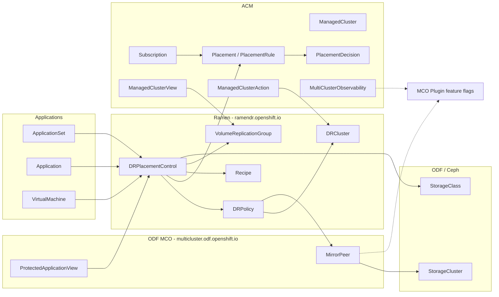
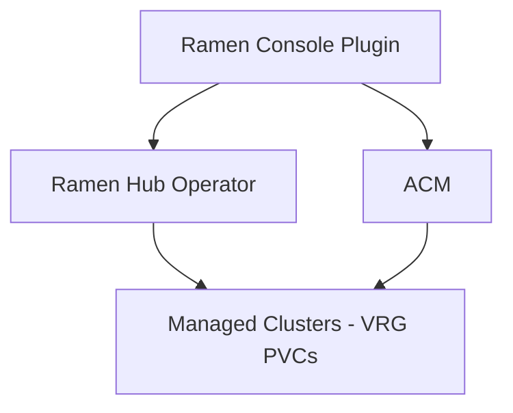

# RamenConsoleComponents

Component inventory, origins, and dependencies for the **Ramen / Disaster Recovery console** delivered by the `ramen-console` repository (fork of [odf-console](https://github.com/red-hat-storage/odf-console), MCO plugin). Derived from [RAMENDR_UI_BUILD_DOCUMENTATION.md](./RAMENDR_UI_BUILD_DOCUMENTATION.md) and the `packages/mco` source tree.

---

## 1. Scope and delivery model

| Aspect | Detail |
|--------|--------|
| **Repository** | `ramen-console/` (workspace: `odf-plugin`, package `@odf/mco`) |
| **Plugin name** | `odf-multicluster-console` (MCO plugin) |
| **Host** | OpenShift Console (dynamic plugin, ACM perspective) |
| **Primary route** | `/multicloud/data-services/disaster-recovery` |
| **What it manages** | Ramen DR CRDs (create/edit/delete via UI) |
| **What it consumes** | ACM, ODF/MCO, Argo CD, KubeVirt, core K8s objects (read/watch) |

The console is **not** a standalone app. It is a remote module loaded by OCP Console and talks to the hub cluster API (and ACM proxy/search where configured).

---

## 2. Backend operators and controllers

These are the **cluster-side** components the UI assumes are installed. The UI does not embed operators; it watches CRDs and metrics they reconcile.

| Operator / controller | Origin | Role relative to console |
|----------------------|--------|---------------------------|
| **Ramen hub operator** (`ramen-hub-operator`) | [RamenDR/ramen](https://github.com/RamenDR/ramen) | Reconciles `DRPolicy`, `DRCluster`, `DRPlacementControl`; creates/watches `VolumeReplicationGroup` on managed clusters; exposes `ramen-hub-operator-metrics-service` and sync metrics (`ramen_sync_duration_seconds`). Config: ConfigMap `ramen-hub-operator-config` / key `ramen_manager_config.yaml`. |
| **Ramen cluster operator** (`odr-cluster-operator` on spokes) | Ramen DR packaging | Per-cluster DR execution; CSV health surfaced in storage-system dashboard queries. |
| **ODF Multicluster Orchestrator** (`odf-multicluster-orchestrator`) | ODF multicluster stack | Reconciles `MirrorPeer`, `ProtectedApplicationView`; labels such as `multicluster.odf.openshift.io/created-by`. |
| **ODR hub operator** (`odr-hub-operator`) | ODF DR hub | Hub-side DR orchestration companion to Ramen/ODF. |
| **VolSync** (`volsync`) | Kubernetes DR ecosystem | Referenced in dashboard pod-health queries for DR replication path. |
| **ODF / OCS operator** | [ODF](https://github.com/red-hat-storage/odf-operator) / Rook-Ceph | `StorageCluster`, Ceph/RBD mirror metrics; storage class provisioners (`CEPH_PROVISIONERS`). |
| **ACM** (multicluster engine) | [open-cluster-management](https://github.com/open-cluster-management-io) | Fleet: `ManagedCluster`, placements, subscriptions, observability, cross-cluster views/actions. |
| **Argo CD** (GitOps) | Argo Project | `ApplicationSet` for managed-application DR flows. |
| **KubeVirt** | CNCF / OpenShift Virtualization | `VirtualMachine` DR enrollment and status columns. |

Constants in code (`packages/mco/constants/common.ts`) name hub operators and config objects explicitly.

---

## 3. Custom resources (CRDs) by origin

### 3.1 Ramen (`ramendr.openshift.io/v1alpha1`) — **primary, UI-managed**

| CRD | API group | Namespaced | Console usage |
|-----|-----------|------------|---------------|
| **DRPolicy** | `ramendr.openshift.io` | No | Create/list/delete policies; topology; replication schedule & cluster pairing. |
| **DRCluster** | `ramendr.openshift.io` | No | S3 profile, cluster fence, CIDRs; created during policy wizard (incl. third-party storage path). |
| **DRPlacementControl** (DRPC) | `ramendr.openshift.io` | Yes | Application protection, failover/relocate, PVC/kube object selectors, Recipe refs. |
| **VolumeReplicationGroup** (VRG) | `ramendr.openshift.io` | Yes | Status, protected PVCs, sync state (watched on spokes via ManagedClusterView). |
| **Recipe** | `ramendr.openshift.io` | Yes | Referenced in DRPC `kubeObjectProtection.recipeRef`; discovered via ACM search API (no local `RecipeModel` in shared models). |

Models: `packages/shared/src/models/ramen.ts`. Types: `packages/mco/types/ramen.ts`.

### 3.2 ODF Multicluster Orchestrator (`multicluster.odf.openshift.io/v1alpha1`) — **ODF/MCO integration**

| CRD | Console usage |
|-----|---------------|
| **MirrorPeer** | Created when building DR policy for ODF-backed clusters; SSAR admin gate; cluster pairing validation; dashboard peer discovery. |
| **ProtectedApplicationView** (PAV) | Aggregated protected-app list per cluster; hooks `useProtectedAppsByCluster`, protected applications page. |

Models: `packages/shared/src/models/odf-mco.ts`. Types: `packages/mco/types/odf-mco.ts`, `types/pav.ts`.

### 3.3 ACM / OCM — **fleet & GitOps integration**

| CRD | API group | Console usage |
|-----|-----------|---------------|
| **ManagedCluster** | `clusterview.open-cluster-management.io` | Cluster picker, topology, policy wizard. |
| **Placement** | `cluster.open-cluster-management.io` | DRPC `placementRef` (modern ACM). |
| **PlacementRule** | `apps.open-cluster-management.io` | Legacy placement; subscription wiring. |
| **PlacementDecision** | `cluster.open-cluster-management.io` | Resolved target clusters for placements. |
| **Subscription** | `apps.open-cluster-management.io` | Map ACM apps → placements → DRPC. |
| **MultiClusterObservability** | `observability.open-cluster-management.io` | Feature flag `ACM_OBSERVABILITY` (Ready condition). |
| **ManagedClusterView** | `view.open-cluster-management.io` | Fetch VRG/PVC/resources from managed clusters. |
| **ManagedClusterAction** | `action.open-cluster-management.io` | Push templates (e.g. third-party storage payloads) to spokes. |
| **Application** | `app.k8s.io` | ACM application list actions & DR status column. |

Models: `packages/shared/src/models/acm.ts`. Types: `packages/mco/types/acm.ts`.

### 3.4 ODF / Ceph / storage — **optional ODF path**

| CRD / resource | API group | Console usage |
|----------------|-----------|---------------|
| **StorageCluster** | `ocs.openshift.io` | ODF version & `cephClusterFSID` from MCV config maps; policy validation (RDR vs MDR). |
| **StorageSystem** | `odf.openshift.io` | Storage system dashboard (with observability flag). |
| **CephCluster** | `ceph.rook.io` | Indirect (metrics / topology in shared package). |
| **StorageClass** | `storage.k8s.io` | Provisioner validation (`CEPH_PROVISIONERS`, `IBM_PROVISIONERS`). |
| **PersistentVolumeClaim** | core | PVC selection in assign-policy & discovered-app wizards. |
| **ConfigMap / Secret** | core | Ramen S3 config, TPS payload creation, cluster secrets. |

Heavy ODF usage is concentrated in **create-dr-policy**, **mco-dashboard/storage-system**, and **features.ts** (MirrorPeer SSAR).

### 3.5 Other integrations

| Resource | Origin | Console usage |
|----------|--------|---------------|
| **ApplicationSet** | `argoproj.io` | Failover/relocate/manage-policy modals. |
| **VirtualMachine** | `kubevirt.io` | VM DR management & status column. |
| **SelfSubjectAccessReview** | `authorization.k8s.io` | Admin capability detection. |

---

## 4. Console UI components (exposed modules)

Registered in `plugins/mco/console-plugin.json` and `console-extensions.json`.

| UI area | Module / path | Primary CRDs & APIs |
|---------|---------------|---------------------|
| **Disaster recovery hub** | `disasterRecoveryPage` | Tabs: Overview, Topology, Policies, Protected applications |
| **DR Overview dashboard** | `mco-dashboard/disaster-recovery` | DRPolicy, DRPC, Prometheus (`ramen_*`, `ceph_rbd_mirror_*`) |
| **Topology** | `components/topology` | DRPolicy, DRPC, ManagedCluster, app groupings |
| **Policies list** | `drpolicy-list-page` | DRPolicy, DRCluster, MirrorPeer |
| **Create DR policy** | `create-dr-policy` | DRPolicy, DRCluster, MirrorPeer, StorageCluster (via MCV), Secrets |
| **Protected applications** | `protected-applications` | ProtectedApplicationView, DRPC |
| **Storage system dashboard** | `systemDashboard` | ODF metrics, StorageCluster, CSV operators (requires `ACM_OBSERVABILITY` + `ADMIN`) |
| **Failover / Relocate** | `appFailoverRelocate` | DRPC patch (`action`: Failover/Relocate) |
| **Manage DR policies** | `appManagePolicy` | DRPC create/update, Placement, Recipe, PVC |
| **Enroll discovered application** | `enrollDiscoveredApplication` | DRPC in `openshift-dr-ops`, Recipe params |
| **DR status popover** | `dataPolicyStatusPopover` | DRPC/VRG conditions (ACM app & VM columns) |
| **Remove DR** | `modals/remove-disaster-recovery` | DRPC delete |
| **Generic YAML editor** | `editPage` (@odf/core) | Any registered CRD route |
| **Feature detection** | `features` | MultiClusterObservability, MirrorPeer SSAR |

Navigation: ACM perspective → **Data Services** → **Disaster recovery** / **Storage system**.

---

## 5. Component dependency diagram

### 5.1 Runtime stack (host → cluster)



### 5.2 CRD dependency graph (data plane)



**Legend**

- **Solid arrows**: spec references or operator-created child resources.
- **Dotted arrows**: feature detection / optional integration (not required to render base DR pages).

### 5.3 UI feature → backend matrix

| UI feature | Required | Optional (ODF/Ceph) | Optional (ACM) |
|------------|----------|---------------------|----------------|
| DR Policy list/create | Ramen CRDs, Ramen operator | MirrorPeer, StorageCluster, Ceph FSID | ManagedCluster |
| Protected applications | DRPC, PAV | — | MCV for details |
| Failover / Relocate | DRPC | — | Application / ApplicationSet |
| Topology | DRPolicy, DRPC, ManagedCluster | MirrorPeer for peer edges | — |
| Storage system dashboard | — | ODF metrics, StorageCluster, OCS CSV | MultiClusterObservability |
| Admin-gated routes | SSAR | MirrorPeer create permission | — |
| Discovered apps wizard | DRPC, Recipe (search) | — | ACM search API |

---

## 6. Codebase dependency map (build-time)

```
ramen-console/
├── plugins/mco/                    # Built plugin manifest & extensions
├── packages/mco/                   # DR UI logic (@odf/mco)
│   ├── features.ts                 # ACM observability + MirrorPeer SSAR
│   ├── hooks/mco-resources.ts      # K8s watch object builders
│   ├── components/                 # Pages, modals, topology, dashboards
│   └── types/                      # Ramen, ACM, ODF-MCO TypeScript types
└── packages/shared/                # Shared models & utilities (@odf-console/shared)
    ├── models/ramen.ts             # DRPolicy, DRCluster, DRPC, VRG
    ├── models/acm.ts               # ACM CRD models
    ├── models/odf-mco.ts           # MirrorPeer, PAV
    ├── models/storage.ts           # StorageCluster, CephCluster, ...
    └── constants (CEPH_PROVISIONERS, metrics helpers)
```

**npm/workspace**: `@odf/mco` → `@odf-console/shared` → OpenShift Console Dynamic Plugin SDK, PatternFly, React 17.

---

## 7. Proposed plan: remove ODF/Ceph entities not required for Ramen / ACM

Goal: a **Ramen + ACM–centric** console build that drops ODF Multicluster Orchestrator and Ceph-specific assumptions while preserving core DR workflows (DRPolicy, DRCluster, DRPC, failover/relocate, discovered apps where possible).

### 7.1 Classification of ODF/Ceph touchpoints

| Area | Files / symbols | Ramen/ACM needed? | Proposed action |
|------|-----------------|-------------------|-----------------|
| Admin SSAR | `features.ts` — `MirrorPeerModel` | No | Replace with SSAR on `drpolicies.ramendr.openshift.io` `create` or static admin flag for standalone builds. |
| Create DR policy — MirrorPeer | `create-dr-policy/utils/k8s-utils.ts`, `CreateDRPolicyForm.tsx` | No for non-ODF DR | Gate MirrorPeer create behind `BackendType.DataFoundation`; default to **Third Party** path only. |
| Cluster validation | `selected-cluster-validator.tsx` — `cephFSID`, `CEPH_PROVISIONERS` | No for TPS | Split validator: ODF path optional module; TPS uses generic storage class / provisioner list. |
| Replication type | `select-replication-type.tsx` — `cephFSID` RDR/MDR | No for TPS | Use explicit user selection or DRPolicy API semantics only. |
| DRPolicy list cleanup | `drpolicy-list-page.tsx` — MirrorPeer unpaired DRClusters | Partial | Use DRCluster `manageS3` / Ramen config only; drop MirrorPeer pairing logic. |
| Dashboard — RBD metrics | `mco-dashboard/queries.ts` — `ceph_rbd_mirror_*` | No | Remove charts or replace with `ramen_sync_duration_seconds` / VRG-based status only. |
| Storage system dashboard | `mco-dashboard/storage-system/**` | No | Remove navigation entry (`systemDashboard`) and `StorageClusterModel` usage from MCO plugin; keep in full ODF monorepo if needed. |
| Cluster app card | `cluster-app-card.tsx` — MirrorPeer peer list | No | Derive peers from `DRPolicy.spec.drClusters` only. |
| ODF capacity/health queries | `queries.ts` — `odf_system_*`, `ODF_OPERATOR` | No | Delete from Ramen-only build target. |
| Shared package | `packages/shared` storage/topology/OSD | No for MCO | Introduce slim `@odf-console/shared-dr` or tree-shake imports so MCO bundle does not pull Ceph topology widgets. |
| MCO operator constants | `ODFMCO_OPERATOR`, `MCO_CREATED_BY_*` | No | Rename plugin/branding to Ramen DR; drop ODF MCO operator health cards unless operator is still deployed. |
| ProtectedApplicationView | ODF MCO CRD | Optional | **Phase 2**: replace with DRPC list + labels only, or Ramen-native aggregation if upstream adds it. |

### 7.2 Phased implementation

**Phase 1 — Decouple feature gates (low risk)**

1. `features.ts`: Remove `MirrorPeer` SSAR; use Ramen CRD SSAR or config flag `RAMEN_STANDALONE_ADMIN=true`.
2. `console-extensions.json`: Remove **Storage system** nav/route (`systemDashboard`) from Ramen distribution.
3. Document required operators: Ramen hub + ACM only.

**Phase 2 — Create DR policy without ODF (medium risk)**

1. Remove `createMirrorPeer` / `fetchMirrorPeer` from default wizard flow.
2. Make **Third Party Storage** the default backend in `BackendType` UI.
3. Keep DRCluster + S3 profile creation via `tps-payload-creator.ts` / Ramen ConfigMap (already Ramen-centric).
4. Remove `StorageCluster` / MCV config map parsing from `cluster-list-utils.ts` for non-ODF builds.

**Phase 3 — Dashboard & metrics (medium risk)**

1. Replace `getRBDSnapshotUtilizationQuery` usages with Ramen metrics or remove widgets.
2. Strip `mco-dashboard/storage-system` from `packages/mco` build entry or guard with feature flag.

**Phase 4 — Shared library split (higher effort)**

1. Extract DR+ACM models from `packages/shared` into a minimal shared package.
2. Remove transitive imports of `CephClusterModel`, `StorageClusterModel`, OSD topology from MCO webpack graph.
3. Adjust CI: `yarn build-mco` produces Ramen-only bundle; optional `build-mco-odf` for full stack.

**Phase 5 — PAV and ODF MCO CRDs (product decision)**

1. If PAV is ODF-only, reimplement protected applications view using hub `DRPlacementControl` list + per-cluster VRG via `ManagedClusterView`.
2. Drop dependency on `multicluster.odf.openshift.io` API group entirely.

### 7.3 Target end-state architecture



**Removed from critical path**: MirrorPeer, StorageCluster, Ceph RBD mirror metrics, ODF MCO operator UI, `cephFSID` validation, ODF storage system dashboard.

### 7.4 Functional coverage after removal

| Feature | Full ODF+ACM build | Proposed Ramen+ACM build |
|---------|-------------------|---------------------------|
| DRPolicy / DRCluster UI | Yes | Yes |
| DRPC / failover / relocate | Yes | Yes |
| ACM managed apps (Placement, Subscription) | Yes | Yes |
| Discovered applications + Recipe | Yes | Yes (ACM search retained) |
| MirrorPeer auto-create on policy | Yes | No |
| ODF version / Ceph FSID checks | Yes | No |
| Storage system dashboard | Yes | No |
| RBD mirror Prometheus charts | Yes | No (Ramen metrics only) |
| ProtectedApplicationView list | Yes | Replace with DRPC-centric view (Phase 5) |

### 7.5 Validation checklist

- [ ] `yarn build-mco` succeeds without importing `MirrorPeerModel` in default code paths.
- [ ] Create DR policy completes with Third Party backend only (no `multicluster.odf.openshift.io` objects created).
- [ ] Admin routes work with Ramen SSAR instead of MirrorPeer SSAR.
- [ ] Failover/relocate and DRPC status popover work with ACM apps and discovered apps.
- [ ] Bundle size reduction measured (`yarn analyze-mco`).
- [ ] E2E/smoke: hub with Ramen + ACM, without ODF operator installed.

---

## 8. References

| Resource | URL / path |
|----------|------------|
| Ramen operator & CRDs | https://github.com/RamenDR/ramen |
| ODF Console upstream | https://github.com/red-hat-storage/odf-console |
| Build documentation | [RAMENDR_UI_BUILD_DOCUMENTATION.md](./RAMENDR_UI_BUILD_DOCUMENTATION.md) |
| MCO plugin manifest | `ramen-console/plugins/mco/console-plugin.json` |
| Ramen models | `ramen-console/packages/shared/src/models/ramen.ts` |
| MCO resource hooks | `ramen-console/packages/mco/hooks/mco-resources.ts` |

---

## 9. Summary

The **ramen-console** MCO plugin is the operational UI for **Ramen DR CRDs**, embedded in OpenShift Console under ACM. It **manages** `DRPolicy`, `DRCluster`, and `DRPlacementControl`, and **watches** `VolumeReplicationGroup`, ACM fleet objects, and—today—**ODF MCO** (`MirrorPeer`, `ProtectedApplicationView`) and **Ceph/ODF storage** artifacts for policy creation, admin gates, and storage dashboards.

A Ramen/ACM-focused distribution should treat ODF/Ceph integration as **optional modules**, remove MirrorPeer-centric flows and Ceph metrics from the default path, and eventually shed `multicluster.odf.openshift.io` and `ocs.openshift.io` dependencies from the MCO package build.
